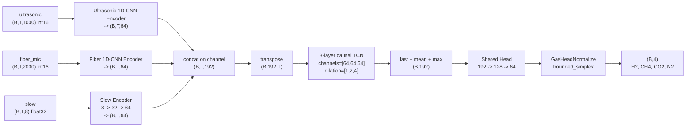

# CNN1D-TCN 当前模型说明

## 1. 文档范围

本文档说明当前正式实验中使用的 CNN1D-TCN 版本，默认指下面这套配置与实现：

- 配置文件：`configs/deep/bounded_simplex_3task_loss_slow_branch.yaml`
- 模型类：`src/dl/models/cnn1d_tcn_fusion_slow_branch.py`
- 训练入口：`src/pipeline/train_deep.py`
- 训练编排：`src/dl/training/orchestrator.py`
- 当前结果目录：`outputs/exp02_deep_e2e/v3_bounded_simplex_3task_loss_slow_branch_seed42/01`

它不是最早的 `cnn1d_tcn_fusion` 基线，而是其后续的 `slow_branch + bounded_simplex + 3-task loss` 版本。

## 2. 一页结论

这套模型的核心目标是：同时利用两路高频声学波形和一组低频慢变量，在保证组分预测非负且总和恒等于 `100` 的前提下做四组分回归。

它的关键设计有 4 个：

1. 两路波形分别由专用 1D-CNN 编码成逐时间步 embedding。
2. 慢变量不是直接裸拼接，而是先经过逐时间步 MLP 编码。
3. 三路特征在时间维上拼接后送入因果 TCN 建模时序依赖。
4. 输出头采用 `bounded_simplex` 参数化，只显式预测 `H2 / CH4 / CO2` 的比例和前三项总量，`N2` 由残差推导。

当前配置下：

- 输入：`ultrasonic[1000] + fiber_mic[2000] + slow[8]`
- 输出：`[x_H2, x_CH4, x_CO2, x_N2]`
- 总参数量：`266,564`
- TCN 感受野：`29` 个 timestep
- 当前这次正式 run 的测试集 `macro RMSE = 1.8123`

## 3. 文件地图

### 3.1 模型相关

- `src/dl/models/cnn1d_tcn_fusion.py`
  - 提供基础 `DeepAcousticEncoder1D`
  - 提供 `_CausalConv1d` 和 `_TemporalBlock`
  - 提供原始 `CNN1DTCNFusionRegressor`
- `src/dl/models/cnn1d_tcn_fusion_slow_branch.py`
  - 当前正式版本
  - 新增 `SlowFeatureEncoder`
  - 新增 `GasHeadNormalize`
  - 用共享 head + 约束输出头替代原始直接 MLP 输出

### 3.2 训练相关

- `src/pipeline/train_deep.py`
  - 命令行入口
- `src/dl/training/data_setup.py`
  - 数据集构建、split、slow scaler 拟合
- `src/dl/training/runtime.py`
  - 单 epoch 训练与评估
- `src/dl/training/losses.py`
  - `MSE`、`SlicedLoss`、`UncertaintyWeightedLoss` 等
- `src/dl/training/orchestrator.py`
  - 完整训练编排、早停、checkpoint、summary 写出

## 4. 输入数据与预处理

## 4.1 数据集类型

当前配置使用：

```yaml
data:
  dataset_type: waveform_v3
  npz_path: ../../data/waveform_v3
  split_dir: ../../data/waveform_v3/splits
  scaler_path: ../../data/waveform_v3/scalers/scaler_slow_sequence.json
  split_strategy: existing_or_group_mixture
  time_window: all
```

也就是说，模型直接吃 waveform 包，不是传统 ML 的表格特征。

## 4.2 单样本张量结构

每个样本来自 `WaveformSequenceDataset`，返回：

- `ultrasonic`: `(T, 1000)`，`int16`
- `ultrasonic_scale`: `(T,)`，`float32`
- `fiber_mic`: `(T, 2000)`，`int16`
- `fiber_mic_scale`: `(T,)`，`float32`
- `slow`: `(T, 8)`，`float32`
- `target`: `(4,)`，`float32`

当前慢变量 8 通道顺序固定为：

1. `V_NDIR_CH4`
2. `V_NDIR_CO2`
3. `V_TCS`
4. `T_C`
5. `P_MPa`
6. `H_RH`
7. `L_m`
8. `piston_position_m`

标签顺序固定为：

1. `x_H2`
2. `x_CH4`
3. `x_CO2`
4. `x_N2`

## 4.3 预处理规则

- 波形不做离线标准化，训练时保留 `int16 + scale` 形式。
- `slow` 会使用 train split 上拟合的 scaler 做标准化。
- 标签不做 z-score 变换，loss 直接在原始百分比空间计算。
- `label_scaler.json` 主要用于记录 train split 标签统计量；当前配置下不启用 `label_balanced_loss`，因此不会把标签标准差转成 loss 权重。

## 4.4 当前数据规模

当前正式 run：

- train: `16,486`
- val: `4,507`
- test: `4,507`

## 5. 整体框架



## 6. 分模块说明

## 6.1 波形编码器 `DeepAcousticEncoder1D`

超声和光纤麦克风各自有一套独立 encoder，但结构相同，参数不共享。

配置：

- `embedding_dim = 64`
- `channels = [16, 32, 64, 64]`
- `kernel_size = 7`
- `dropout = 0.15`

卷积栈规则：

- 前 `N-1` 层 `stride=2`
- 最后一层 `stride=1`
- 每层后接 `BatchNorm1d + ReLU`

### 6.1.1 超声分支形状变化

输入长度 `1000`：

- `1000 -> 500 -> 250 -> 125 -> 125`

### 6.1.2 光纤麦克风分支形状变化

输入长度 `2000`：

- `2000 -> 1000 -> 500 -> 250 -> 250`

### 6.1.3 输出方式

卷积栈末端做：

- `AdaptiveAvgPool1d(1)`
- `AdaptiveMaxPool1d(1)`
- 拼接 `avg + max + log(scale_factor)`
- 线性投影到 `64` 维

所以每个时间步最终都会被压成一个 `64` 维向量。

### 6.1.4 数值处理

波形编码阶段即使全局开启了 AMP，也会强制用 FP32：

- 卷积分支输入为 `waveform_int16 / 32767`
- 绝对幅值信息通过 `log(scale_factor)` 旁路注入

这样做的原因是波形数值跨度大，FP16 容易在 `int16 -> float` 和 `log` 附近出现数值不稳定。

## 6.2 慢变量编码器 `SlowFeatureEncoder`

这是当前版本相对原始 `cnn1d_tcn_fusion` 的第一个关键改动。

原始基线是：

- 直接把 `slow[8]` 和两路波形 embedding 拼接

当前版本改为：

- `Linear(8, 32)`
- `GELU`
- `Linear(32, 64)`

输出从 `(B, T, 8)` 变成 `(B, T, 64)`。

这样做的目的，是让慢变量在进入融合前先拥有和声学 embedding 同量级的通道宽度，减少“高维波形特征淹没低维 slow”的风险。

## 6.3 融合层

当前配置下：

- 超声 embedding: `64`
- 光纤麦克风 embedding: `64`
- slow embedding: `64`

所以融合后通道数为：

```text
64 + 64 + 64 = 192
```

融合张量形状：

```text
(B, T, 192)
```

随后转成 TCN 所需的 `NCT` 格式：

```text
(B, 192, T)
```

## 6.4 TCN 主干

当前配置：

- `tcn_channels = [64, 64, 64]`
- `tcn_kernel_size = 3`
- `tcn_dropout = 0.25`

每个 `_TemporalBlock` 内部包含：

1. `CausalConv1d`
2. `BatchNorm1d`
3. `ReLU`
4. `Dropout`
5. 第二个 `CausalConv1d`
6. `BatchNorm1d`
7. residual shortcut
8. 最后 `ReLU`

第 `i` 个 block 的 dilation 是：

```text
2 ** i
```

因此本模型 3 层 dilation 为：

```text
[1, 2, 4]
```

### 6.4.1 感受野

每个 block 含两个同 dilation 的因果卷积，kernel size 为 `3`。

TCN 的名义时序感受野为：

```text
RF = 1 + Σ_blocks [2 * (k - 1) * dilation]
   = 1 + 2 * (3 - 1) * (1 + 2 + 4)
   = 29
```

也就是说，某个时刻的 TCN 特征最多看 `29` 个 timestep 的历史。

## 6.5 池化与共享头

TCN 输出形状为：

```text
(B, 64, T)
```

然后做三种汇聚：

- `last = feats[:, :, -1]`
- `avg = feats.mean(dim=-1)`
- `max = feats.amax(dim=-1)`

拼接后得到：

```text
(B, 64 * 3) = (B, 192)
```

共享 head 结构：

- `Linear(192, 128)`
- `ReLU`
- `Dropout(0.25)`
- `Linear(128, 64)`
- `ReLU`
- `Dropout(0.25)`

这里的 `64` 维表示整个样本的共享融合表示，随后才进入最终输出头。

## 6.6 输出头 `GasHeadNormalize`

这是当前版本的第二个关键改动。

当前配置：

```yaml
derive_last: true
derive_last_mode: bounded_simplex
out_dim: 4
output_prior: [9.288469, 75.755157, 4.994778, 9.961745]
```

### 6.6.1 当前实际行为

不是直接回归 4 个组分，而是：

1. 预测 `3` 个 free logits，对应 `H2 / CH4 / CO2` 的相对比例
2. 再预测 `1` 个 total logit，对应前三项的总量
3. 用 `softmax` 把前三项变成比例
4. 用 `sigmoid` 把前三项总量限制在 `(0, 100)`
5. 计算：

```text
free = 100 * sigmoid(total_logit) * softmax(free_logits)
N2   = 100 - sum(free)
```

于是最终输出具备两个硬约束：

- 所有组分非负
- 四组分和恒等于 `100`

### 6.6.2 输出先验

`output_prior` 用训练集标签均值初始化最后一层 bias，使模型一开始就接近训练集组分分布，而不是从完全均匀或随机分布开始。

## 7. 参数量统计

当前配置实例化后的精确参数量如下：

| 模块                   | 参数量         |
| -------------------- | -----------:|
| `ultrasonic_encoder` | 55,504      |
| `fiber_mic_encoder`  | 55,504      |
| `slow_encoder`       | 2,400       |
| `tcn`                | 111,360     |
| `shared_head`        | 32,960      |
| `gas_head`           | 8,836       |
| **总计**               | **266,564** |

说明：

- 两个波形 encoder 参数量相同，因为结构相同，和输入长度无关。
- 当前 TCN 是参数最多的部分，占总参数量约 `41.8%`。

## 8. 训练配置

当前配置文件中的关键训练超参数：

| 项目                      | 当前值           |
| ----------------------- | ------------- |
| epochs                  | 150           |
| batch_size              | 128           |
| device                  | auto          |
| amp                     | true          |
| compile                 | false         |
| optimizer               | AdamW         |
| learning_rate           | 0.0002        |
| weight_decay            | 0.01          |
| loss                    | MSE           |
| label_balanced_loss     | false         |
| uncertainty_weighted    | null          |
| loss_columns            | 3             |
| sum_constraint          | null          |
| early_stopping_patience | 30            |
| grad_clip_norm          | 1.0           |
| num_workers             | 12            |
| eval_num_workers        | 4             |
| cudnn_benchmark         | true          |
| lr_scheduler            | cosine_warmup |
| warmup_epochs           | 15            |
| eta_min                 | 1e-5          |

## 9. 损失函数与监控指标

## 9.1 当前 loss

当前配置是：

```text
MSE + SlicedLoss(num_columns=3)
```

含义是：

- 只对前 `3` 列，也就是 `H2 / CH4 / CO2` 计算 MSE
- `N2` 由 `100 - H2 - CH4 - CO2` 派生，不单独参与 loss

这样做的目的，是避免 `derive_last` 结构下 `N2 loss` 的梯度再反向耦合到前三项，尤其避免对 `CH4` 产生干扰。

## 9.2 训练时监控什么

训练过程中虽然也记录 `train_loss` 和 `val_loss`，但 early stopping 真正监控的是：

```text
val macro_RMSE
```

也就是说：

- `best_model.pt` 不是按 `val_loss` 选的
- 而是按验证集 `macro_RMSE` 最小选的

## 10. 训练流程

完整流程如下：

1. `train_deep.py` 读取 YAML 配置。
2. `data_setup.py` 构建 waveform 数据集。
3. 按 `existing_or_group_mixture` 读取现有 split；若缺失则按 `mixture_id` 分组重建。
4. 在 train split 上拟合 slow scaler。
5. 实例化 `CNN1DTCNSlowBranchRegressor`。
6. 构建 `MSE -> SlicedLoss(3)`。
7. 用 `AdamW` 优化。
8. 用 `cosine_warmup` 调度学习率。
9. 每个 epoch：
   - 训练一个 epoch
   - 在 val 集上评估
   - 记录 `macro_RMSE / macro_MAE / sum error / lr`
   - 若 `val macro_RMSE` 变优，则覆盖 `best_model.pt` 和 `best_checkpoint.pt`
10. 训练结束后加载 best 权重，在 test 集上生成最终 summary、component_metrics 和 predictions。

## 10.1 AMP 与数值策略

- 全局训练开启 AMP
- 但波形 encoder 内部禁用 autocast，强制 FP32
- 梯度裁剪阈值为 `1.0`

## 10.2 `compile: false` 的原因

当前配置显式关闭 `torch.compile`，原因不是保守，而是已有已知问题：

- `bounded_simplex` 和 `torch.compile` 组合下，梯度会失效
- 现象是 train loss 几乎不下降，R² 接近 0

因此当前版本必须用 eager 训练。

## 10.3 验证与保存产物

当前 run 目录下的主要产物：

- `best_model.pt`
- `best_checkpoint.pt`
- `last_checkpoint.pt`
- `initial_checkpoint.pt`
- `predictions.csv`
- `component_metrics.csv`
- `summary.json`
- `train_log.csv`
- `实验报告.md`
- `report_figures/`
- `analysis_plots/`

其中：

- `summary.json` 是最终 test 指标摘要
- `component_metrics.csv` 是逐组分指标
- `predictions.csv` 是测试集逐样本预测
- `train_log.csv` 是逐 epoch 训练日志

## 11. 当前这次正式 run 的结果

当前结果目录：

```text
outputs/exp02_deep_e2e/v3_bounded_simplex_3task_loss_slow_branch_seed42/01
```

实验报告中的关键信息：

- 训练 150 个 epoch
- 最优 epoch 为 `131`
- 设备为 `CUDA + AMP`

测试集指标如下：

| 组分        | RMSE       | MAE        | R²     |
| --------- | ----------:| ----------:| ------:|
| H2        | 0.9560     | 0.6828     | 0.9827 |
| CH4       | 2.8526     | 2.1875     | 0.9122 |
| CO2       | 0.5734     | 0.4179     | 0.9708 |
| N2        | 2.8671     | 2.2478     | 0.7307 |
| **macro** | **1.8123** | **1.3840** | -      |

sum 约束相关指标：

| 指标                 | 值              |
| ------------------ | --------------:|
| mean_true_sum      | 100.0000000108 |
| mean_pred_sum      | 99.9999999693  |
| std_pred_sum       | 3.76e-6        |
| mean_abs_sum_error | 3.51e-6        |
| max_abs_sum_error  | 1.43e-5        |

这说明 `bounded_simplex` 在数值上确实把和约束压得非常紧。

## 12. 这版模型相对原始 `cnn1d_tcn_fusion` 的差异

| 项目      | 原始版                 | 当前版                              |
| ------- | ------------------- | -------------------------------- |
| slow 输入 | 直接拼接 `slow[8]`      | 先过 `8 -> 32 -> 64` MLP           |
| 融合通道数   | `64 + 64 + 8 = 136` | `64 + 64 + 64 = 192`             |
| head 结构 | 直接 MLP 输出 4 维       | shared head + `GasHeadNormalize` |
| 输出约束    | 无硬约束                | 非负且和恒等于 100                      |
| loss    | 常规 4-task           | 3-task only                      |

所以这版模型的重点不只是“慢分支”，而是三件事一起出现：

1. slow branch 编码
2. bounded simplex 输出
3. 3-task loss

## 13. 优势与局限

## 13.1 优势

1. 双波形和慢变量都保留了。
2. 对组分和约束做了硬物理约束，不会出现负浓度或 sum 偏离 100 的问题。
3. N2 不再靠直接回归，而是由前三项和总量约束推出，逻辑更符合当前任务设定。
4. 模型参数量控制在 `26.7 万` 量级，仍属于中等规模。

## 13.2 局限

1. 它不是当前仓库里整体最优的模型，当前报告里仍落后于 `TCN-Multimodal`。
2. `CH4` 和 `N2` 仍是短板。
3. 当前必须禁用 `torch.compile`。
4. TCN 感受野只有 `29` 步，如果未来希望更强的长时依赖建模，可能需要更深层 TCN、扩大 kernel 或改为更长上下文结构。

## 14. 如何复现当前模型

直接运行：

```powershell
python src/pipeline/train_deep.py --config configs/deep/bounded_simplex_3task_loss_slow_branch.yaml
```

如果只想关闭 UI：

```powershell
python src/pipeline/train_deep.py --config configs/deep/bounded_simplex_3task_loss_slow_branch.yaml --no-ui
```

## 15. 如何改这套模型

### 15.1 改结构

改这里：

- `src/dl/models/cnn1d_tcn_fusion_slow_branch.py`

常见结构改动入口：

- `acoustic_channels`
- `waveform_embedding_dim`
- `slow_encoder.hidden_dim / embedding_dim`
- `tcn_channels`
- `tcn_kernel_size`
- `shared_head`
- `GasHeadNormalize`

### 15.2 改训练超参数

改这里：

- `configs/deep/bounded_simplex_3task_loss_slow_branch.yaml`

### 15.3 改训练逻辑

改这里：

- `src/dl/training/losses.py`
- `src/dl/training/orchestrator.py`
- `src/dl/training/runtime.py`

## 16. 最后一句话

当前这版 CNN1D-TCN 可以概括为：

> 两路波形分别提 embedding，慢变量先升维，三路逐时间步融合后交给 3 层因果 TCN 建模，再用 `bounded_simplex` 输出头做四组分受约束回归；训练时只对 `H2 / CH4 / CO2` 施加 loss，用硬约束隐式决定 `N2`。
