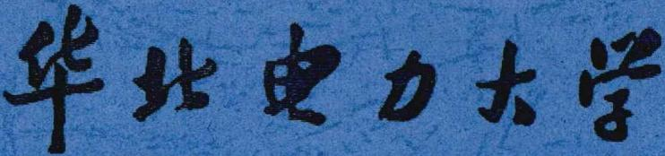

学术硕士学位论文

# 基于声学特性的多元混合气体组分检测研究

# Research on the Detection of Multi-component Mixed Gas Based on Acoustic Characteristics

侯思琴

2024年5月

中国知网 <https://www.cnki.net>

国内图书分类号：TK314

国际图书分类号：53.08

学校代码：10079

密级：公开

# 学术硕士学位论文

# 基于声学特性的多元混合气体组分检测研究

硕士研究生：侯思琴

导师：沈国清副教授

申请学位：工学硕士

学科专业：动力工程及工程热物理

所在学院：能源动力与机械工程学院

答辩日期：2024年5月

授予学位单位：华北电力大学

中国知网 <https://www.cnki.net>

Classified Index: TK314

U.D.C: 53.08

Thesis for the Academic Master's Degree

# Research on the Detection of Multi-component Mixed Gas Based on Acoustic Characteristics

Candidate:

Supervisor:

Academic Degree Applied for:

Speciality :

School:

Date of Defence:

Degree-Conferring-Institution:

Hou Siqin

Prof. Shen Guoqing

Master of Engineering

Power Engineering and Engineering

Thermophysics

School of energy, Power and Mechanical

Engineering

May, 2024

North China Electric Power University

中国知网 <https://www.cnki.net>

## 摘要

锅炉的安全高效、降碳减污运行是实现锅炉绿色高质量发展的关键方向，对积极稳妥推进“碳达峰、碳中和”具有重要意义。因此实时监测气体状态的数据，从锅炉的燃烧效率、污染气体的排放判断运行状态，调整运行参数是研究的关键技术。本文利用气体介质中的声学特征参数随气体种类变化的特性，选择响应快、成本低的声学气体传感技术进行气体检测，采用数值计算、细化重建、实验研究等方法，基于单一气体介质中的声传播机理，探究多元混合气体介质中的声传播特性，构建混合气体测量模型，确定模型的准确性，最终通过实验展示测量成果。具体的研究内容及结论如下：

选择声速和声衰减系数作为气体浓度测量的声学参数。气体的摩尔分子量、温度等特征均会影响声速的变化，声衰减系数用于弥补声速测量存在的局限性。本文提出一种基于混合气体中各组分气体占比的声速模型和声衰减模型，和多元混合气体中的声速-声衰减结合检测方法，利用 MATLAB 对模型中的浓度场进行重建，对测得的声波传播时间数据进行反演，对比多工况下气体浓度场的仿真结果，采用常见的误差计算评价浓度场重建的质量，重建的平均相对误差低至 0.21%，在标准差小于 0.14 的条件下，重建浓度场具有很好的抗干扰效果。

搭建多元混合气体介质中声学特性参数的测量实验平台，通过 TOF 法测量声速，根据声强、声压和测量电压之间的关系实现声衰减系数的测量，实验分别对纯净气体、二元气体、三元气体进行测量。实验结果显示，在纯净气体的测量中，与计算值相比，测量误差在 0.3% 左右，温度对测量结果也产生影响，随着温度的升高，由于分子之间的热运动更加剧烈，碰撞概率增加，声波的衰减加快，声速增加；对二元混合气体的测量结果分析发现，含有弛豫衰减的多原子分子相对于双原子分子和单原子分子具有更明显的衰减特征，声波开始衰减的位置更接近声发射端，而对衰减特征不明显的混合气体，可以根据声波开始衰减的位置进行气体成分的判断；三元混合气体中根据测量数据建立的三维数据场，可选择任意的声速和声衰减系数判断此时的气体成分。为进一步实现声学检测方法的实际应用，实验模拟锅炉尾部烟道中的饱和湿烟气进行二氧化碳含量的测量，发现复杂的气体环境中声衰减可以实现气体含量在 1% 变化时的测量。

关键词：超声；声速；声波衰减；浓度场重建；多元混合气体检测

## Abstract

The safe and efficient operation of boilers with carbon and pollution reduction are the key directions to achieve green and high-quality development of boilers, which are of great significance to actively and steadily promote carbon peaking and carbon neutralization. Therefore, gas real-time monitoring is the key technology to be researched. The combustion efficiency of the boilers and the discharge of pollutant gases can judge the operating status and adjust the operating parameters. In this paper, the acoustic gas sensing technology with fast response and low cost is selected for gas measurement by using the characteristics of acoustic characteristic parameters in gas medium changing with the types of gas. Numerical calculation, refinement reconstruction, experimental research and other methods are used. Based on sound propagation mechanism in single gas media, acoustic propagation characteristics in multi-component mixed gas medium are researched. A mixed gas measurement model is constructed to determine the accuracy of the model. Finally, the measurement results were demonstrated through experiments. The specific research content and conclusions are as follows:

Sound velocity and sound attenuation coefficient are selected as acoustic parameters for gas concentration measurement. The characteristics of gas such as molar molecular weight and temperature affect the change of sound velocity, while sound attenuation coefficient is used as a supplement to make up for the limitations of sound velocity measurement. A sound velocity model and sound attenuation model based on the proportion of each component gas in the mixed gas are proposed, and the combined detection of sound velocity-sound attenuation in multi-component mixed gas is proposed. Using MATLAB to reconstruct the concentration field in the model, inverse the measured acoustic propagation time data and compare the simulation results of gas concentration field under multiple working conditions. Common error calculations are used to evaluate the quality of reconstruction concentration field. The average relative error of reconstruction is as low as 0.21%. Under the condition of standard deviation less than 0.14, the reconstructed concentration field has good anti-interference effect.

An experimental platform for measuring acoustic characteristic parameters in multi-component mixed gas medium is built. The sound velocity is measured by TOF method, and the sound attenuation coefficient is measured according to the relationship between sound intensity, sound pressure and measured voltage. pure gas, binary gas and ternary gas are measured in experiment. Experimental results show that, in the measurement of pure gas, the measurement error is about

0.3% compared with the calculated value. Temperature also affects the measurement results. With the increase of temperature, the collision probability is higher due to the thermal motion between molecules. As a result, the attenuation of sound waves and the sound speed accelerate. The measurement results of binary gas mixtures show that the multi-component gas mixtures with relaxation attenuation have more obvious attenuation characteristics than those of diatomic molecules and monatomic molecules. The position where the sound wave begins to attenuate is closer to the acoustic emission end. For the mixed gas whose attenuation characteristics are not obvious, the gas composition can be judged according to the position where the sound wave begins to attenuate. The three-dimensional data field based on the measured data in ternary gas mixture can judge the gas composition at this time according to any sound velocity and sound attenuation coefficient. In order to further realize the practical application of acoustic detection, The experiment simulates the saturated wet flue gas in the tail flue of the boiler to measure the carbon dioxide content. It is found that the sound attenuation in complex gas can realize the measurement when the gas content changes at 1%.

Keywords: Ultrasound, Sound velocity, Sound attenuation, Concentration field reconstruction, The measurement of ulti-component mixed gas

## 目录

第1章 绪论....1 1.1 课题研究背景及意义....1 1.2 国内外研究现状....2 1.2.1 多组分气体检测研究现状....2 1.2.2 基于声学特性的气体检测技术研究现状....3 1.2.3 研究现状总结....5 1.3 本文的主要研究内容....6 第2章 气体介质中声学检测技术....8 2.1 气体介质中声传播特性的理论分析....8 2.1.1 气体声速理论分析....8 2.1.2 气体声衰减理论分析....11 2.2 气体介质的声学特性测量方法....16 2.2.1 气体介质声速测量方法....16 2.2.2 气体介质声衰减测量方法....19 2.3 本章小结....20 第3章 多元混合气体的声传播特性研究....22 3.1 多元混合气体声学特性参数的计算....22 3.1.1 多元混合气体声速模型....22 3.1.2 多元混合气体声衰减模型....23 3.1.3 声衰减与声速结合检测气体的计算模型....25 3.2 多元混合气体浓度场的重建....26 3.2.1 声学重建中的局部热平衡....27 3.2.2 无噪声下浓度场的声学重建....27 3.2.3 噪声下浓度场的声学重建....31 3.3 本章小结....34 第4章 多元混合气体中声学特性参数测量实验研究....36 4.1 气体声学实验装置....36 4.1.1 气体声学气体腔腔体设计....36 4.1.2 实验系统设计....37 4.1.3 实验方法与测量步骤....38 4.2 多元混合气体实验结果分析....39 4.2.1 纯净气体中声速和声衰减特性....39 4.2.2 二元混合气体中声速和声衰减特性....41 4.2.3 三元混合气体中声速和声衰减特性....43

4.3 锅炉尾部烟道中二氧化碳含量的测量 ..... 44 4.3.1 实验方案设计 ..... 44 4.3.2 测量结果分析 ..... 45 4.4 本章小结 ..... 46 第 5 章 总结及展望 ..... 47 5.1 全文总结 ..... 47 5.2 展望 ..... 48 参考文献 ..... 49

## 第1章 绪论

## 1.1 课题研究背景及意义

作为重要的能源转换设备，锅炉广泛应用于电力、供暖、化工、石油石化、有色金属等行业。目前，我国各类锅炉年消耗能源约20亿吨标准煤，碳排放量约占全国碳排放总量 $40\%$ ，是我国能耗量最大、碳排放量最多的耗能设备\[1]。近年来，我国积极推进锅炉绿色低碳高质量发展，尽管大部分的锅炉系统在节能和环保方面取得了显著进展，但仍存在提升空间，特别是提高锅炉能效、降低碳排放和控制污染物排放水平方面，具有较高的改造潜力\[2]。通过对锅炉运行过程中的气体状态进行监测，及时调整气体成分与含量占比，可以有效改善运行环境，提高运行效率，从多方面实现锅炉的绿色高效运行。

在锅炉燃烧方面，相比于传统化石燃料造成的环境污染，除了发展太阳能、风能等清洁能源来减少污染气体的排放，寻找可以替代化石燃料的清洁燃料同样至关重要。氢气和氨气作为零碳燃料是目前最具应用前景的燃料，将它们与传统燃料进行掺烧，在适当的气体环境中，可以提高燃烧速度，保证燃烧的充分性和稳定性\[3]，然而，氢气与氨气的合理高效利用还需要进一步的研究，氨气的生产、输运储存都具有较为成熟的工业条件，但它的反应活性较低且存在氮氧化物等污染物排放的问题；氢气的制备方式多样，制备资源充足并可循环再生，但氢气的输运和存储仍存在较大风险\[4]。目前，多数学者开展了氢气含量对燃气锅炉燃烧过程调控作用的实验与模拟研究\[5]，国家也已经布局了天然气管网中掺氢的项目，将氢气添加到天然气管道中\[6]，可输送至用户终端燃烧，因此可选择合适的气体传感技术，不仅可以对气体输运过程中的气体成分进行监测，及时发现和预测输运过程中出现气体泄漏现象，还可以根据检测到的掺烧过程中的气体含量，灵活调节气体含量，建立掺烧气体比例对燃烧状态与污染物排放特性变化的影响关系，实现燃烧状态最优化。

另外，在气体污染物排放方面，在锅炉运行过程中，产生的氮氧化物，二氧化碳、二氧化硫和灰尘等污染物，是造成大气污染的部分主要因素。为减少氮氧化物和二氧化碳的排放，满足国家发布的相关污染物排放标准，氮氧化物的超低排放主要通过低氮燃烧技术和SCR脱硝技术来实现\[7]，而实现二氧化碳的减排，需要提升二氧化碳监测的精确度，完善二氧化碳监测体系，这些技术均需要依靠灵活且便捷的气体测量方法进行实现，例如，及时根据监测到的氨氮浓度的比例分布以及氨的浓度合理调整各个喷氨管的喷氨用量；采用新型的气体连续监测方法，实现与核算法共同支撑起的碳排放高质量管理。

综上所述，锅炉运行过程中气体成分与浓度的监测与控制是确保其安全高效，绿色低碳运行的重要方法，采用高效高准确度的技术进行稳定的监测是十分必要的。对锅炉中的气体进行实时有效地监测，既有利于及时调整锅炉运行工况的相关参数，提高锅炉的运行效率，保障运行安全；又可以针对性地减少污染物的排放，从而合理选择污染物后处理方案，实现污染物定向清理，进而降低电厂运行成本。

## 1.2 国内外研究现状

## 1.2.1 多组分气体检测研究现状

目前，根据不同的气体特性以及应用场景，气体检测方法多种多样，主要包括光干涉法、光声光谱法\[8]、电化学法\[9]、半导体法\[10]、燃烧催化法\[11]等。

光干涉法的主要原理为气体折射率随着气体成分，浓度、温度和压力的不同发生变化，因此产生光干涉现象，根据干涉条纹的数量受到气体成分及成分浓度变化的影响，建立气体浓度与气体折射率或干涉条纹位移的模型，即可得到待测气体浓度，该方法原理简单，操作便捷且成本较低，但其准确度受环境影响较大，应用场景受到限制；光声光谱技术是基于光声效应实现的，不同状态的气体对光的吸收程度不同，进而产生不同特征的声波信号，利用声传感器接收到声信号并进行分析，即可得到待测气体的浓度，根据测量原理，光声光谱法灵敏度较高，规避了光反射、光散射的影响，适用于反射能力强，吸收能力弱的信号测量，测量结果准确灵敏，但该技术测量过程复杂繁琐且成本较高，在复杂环境中应用还不够成熟；电化学方法测量气体浓度与成分的主要工作原理包括电极反应，电荷传输，电信号测量以及校准和分析，传感器电极与被测气体发生氧化或还原反应，得到电信号与气体的浓度成正比的关系，电化学测量方法耗电少，线性度高，广泛应用于实验室领域并进行有毒有害气体检测，但其使用寿命短，无法检测高浓度环境下的气体；半导体气体测量传感器可分为电阻型和非电阻型，其测量原理为气敏效应，气体分子的变化引起敏感材料电阻特性或二极管的整流特性的改变，目前大量新型氧化物材料的研究大大提高了传感器的应用效果和范围，具有良好的测量稳定性，检验气体种类多，工作环境多样等优势，但其气敏元件的选择以及灵敏度的不足仍然是目前研究的重点；催化燃烧式气体传感器的测量原理相较于半导体气体测量原理更加复杂，气体在催化元件上发生的反应先引起传感器表面或者内部的温度变化，再进一步导致线圈电阻的变化，从而实现气体浓度的测量，虽然该方法测量的准确度高，但存在振动引起漂移、中毒效应以及灵敏度低的缺陷。

总的来说，气体测量方法种类繁多，并且具有不同的测量优势，但随着应用场景的复杂多变，这些检测技术仍然存在一定的局限性：传感器受到测量环境的影响导致测量精度的下降或使用寿命降低，抗干扰性较差，或传感器自身的测量条件会破坏测量环境，对于特定的高湿冷凝、颗粒物较多的环境并没有合适的传感器进行精确的测量。而随着声学测量技术的不断发展，利用声学特征参数进行气体成分与浓度的判断可以更好地适用于多个应用场景，在无氧环境中仍可以正常工作\[12]，并且针对测量误差可以采用补偿手段进行修正，经济性、灵活性更高，使用寿命长，响应速度快，可以更好地进行全场检测、在线检测，声学测量技术的快速发展和深入研究为提高气体检测的精度、灵敏度和实时性提供了有力的工具，推动了该领域的不断创新和进步。

## 1.2.2 基于声学特性的气体检测技术研究现状

声波在气体介质中传播时可用于测量的声学特征参数众多，其中声速和声衰减系数对气体介质的变化具有高度敏感性，受到不同种类气体分子的结构、环境温度、浓度、湿度、压力等的直接影响，测量具有实时性和非入侵性，广泛适用于各种环境和场景，因此基于声学特性的气体检测技术主要选择这两个声学特征参数进行研究。

19 世纪末，最早的气体声学的应用由德国著名的化学家 Fritz Haber $^{[13]}$ 设计，他发现当瓦斯泄露后，空气中混入了甲烷和氢气后分子质量减小，导致声速增加，哨子发生共振而音调会变高，因此发明了“瓦斯哨子”进行报警，这是声速首次被应用于定性气体检测领域。1923年，R. Geberth $^{[14]}$ 发明了最早的用于检测二元混合气体的电声传感器，测量原理主要利用氢气与氧气的分子质量的差异，即使氢气的含量变化很少，也会引起腔体的质量发生显著变化，进而导致谐振器的共振频率发生变化，测得的氢含量可达0.1%，适用于检测氢气含量的应用场景。在1926年，Griffiths $^{[15]}$ 采用石英晶体同样设计了基于声共振效应的声速测量装置，用于测量混合气体中二氧化碳的含量，精度可达到2%。这些研究说明采用声速的变化来标定气体浓度的变化是可行的，声波测量技术得到了初步的应用。之后，随着超声技术的不断发展，超声换能器制造工艺的提升，基于声传播时间（time-of-flight: TOF）的气体测量技术的出现大大提高了测量精度，1981年，Guillon $^{[16]}$ 采用TOF的方法分析了3He-4He气体混合物的成分占比，测量精度达到0.6%。随后研究人员在不同的气体使用背景下对二元混合气体中的声速进行了测量，1994年，Lueptow和Phillips $^{[17]}$ 也是利用TOF的方法，首次对多元混合气体中的声速进行研究，在不改变天然气中其他组分的情况下，测量了甲烷这一主要成分的含量从75%变化到100%时的声速从400m/s增大到450m/s，建立预测模型，用于实际天然气中的甲烷含量的预测，该模型实现了准确可靠的预测效果，帮助监测和控制天然气的品质，确保天然气的安全、高效利用。以上的研究和应用多集中于二元混合气体的测量，而在实际的测量环境中往往面临着更为复杂的气体介质，单独依靠声速的声学测量技术并无法准确判断气体组分和占比，还需要进一步寻找新的声学特征参数来标定气体构成。

1985 年，Terhune $^{[18]}$ 基于对核反应堆中氧、氢和水蒸气需要实时监测的需求，设计了可以定量检测三元混合气体的装置，对同一工况下的声速和声吸收量进行测量，并分析这是由于气体声学的经典衰减造成的。而在 2003 年，Phillips 等人 $^{[19]}$ 完善了这一理论分析，将声衰减的机理扩展到了气体传感的分析中，在汽车燃料监测、航天飞船中的空气再生系统监测方面以及工业过程控制等领域得到应用，为成分和比例确定的混合气体的测量提供了一种新的方法，正式提出了基于声衰减和声速的气体探测理论模型（Dain and Lueptow model: DL），并提出应用于多元混合气体的展望。之后，研究者们不断对 DL 模型进行完善和修正 $^{[20]}$ ，并设计了相关的测量装置，2003 年，Ejakov $^{[21]}$ 等采用不同频率的四组超声波换能器，利用步进电机控制换能器之间的距离，实验在一个圆柱形腔体中进行，得到多个频率点的声速和声弛豫吸收谱系数。2006 年，Petculescu $^{[22]}$ 减少了测点的布置，通过在管道内布置两对不同距离的超声换能器，进行气体浓度的在线检测，2012 年，Petculescu 和 Lueptow $^{[23]}$ 对之前的研究进行总结归纳，提出定量声弛豫谱（Quantitative Acoustic Relaxational Spectroscopy: QARS），阐明了弛豫过程与分子运动的关系，建立分子声学金字塔，奠定了声弛豫理论的基础。2016 年，Dimas Avila $^{[24]}$ 根据之前的理论，设计制作了可实时检测气体组分的模型。

国内关于气体声学的研究起步较晚，但在建立模型的准确度和理论分析的深度等方面都进行了创新性的研究。在声速检测方法研究中，多采用超声波相位差法进行检测，2013年，丁喜波等\[25]提出用测量到的超声波相位差来表征声速的变化，进而反应气体状态的变化，实验采用甲烷进行测量，并采用温度补偿法提高测量精度。2017年，丁鑫等\[26]针对氢气声速的特殊性，提出了双通道测量的方法，研制出适合氢气测量的气体检测仪。2022年，刘鸿超\[27]设计了基于超声波相位差法的二氧化碳浓度检测系统，包括相关的硬件电路设计和单片机软件设计，并研究了环境温度和湿度的影响效果和误差，提高了测量精度。

在声衰减检测机理的研究中，2012年，华中科技大学张克声\[28, 29]分析了DL模型仍然存在的问题，指出振动弛豫决定了声弛豫吸收谱峰值点的频率，并引入分子内外自由度温度变化率之比描述气体分子内外自由度对温度变化响应速率的比值，从而更加准确预测声波在混合气体中的分子相互作用和能量转换情况，建立了适用于多元混合气体的声弛豫模型，并且随后又提出了无需改变气体压强，仅需测量两频点的声速值和声吸收值\[30]，但可以更好获取气体分子的结构特征的方法。2014年，华北电力大学刘岩等人\[31]建立了声学参数与混合气体速度、温度和浓度的耦合二维模型，实现基于声学测量的多物理场的重建，对传统的DL模型进行了简化。在之后基于声弛豫方法的气体检测技术基本都是基于双频点测量法进行的，并进行不断地完善和推进。2016年，胡轶等人\[32, 33]提出了一种将不同气体的单弛豫时间进行耦合，从而得到整体的弛豫时间来构造有效弛豫区域的方法，解决了混合气体中出现多个强弛豫气体时难以测量的问题。2018年朱明等人\[34]针对双频点测量方法只能得到主要气体的弛豫特征，提出了一种新的基于频率的声弛豫谱分解的构建方式，从而得到所有气体分子的弛豫过程。2020年，张向群等人\[35]选择掺氢的混合气体为研究对象，分析了声波在其中传播时的弛豫现象，根据氢气以转动弛豫为主的特性设计了掺氢混合气体弛豫模型，并深入探究了氢气分子转动弛豫过程的机理，填补了现有理论在氢气和掺氢混合气体中应用的空白。2021年，中国计量大学等人\[36]提出一种基于回波电压的双频测量方法进行二氧化碳含量的检测，设计了机械结构和测量电路，计算两种不同频率下的声衰减系数，得到弛豫吸收和气体浓度之间的关系，并且进行了相关的实验验证。为降低电力运营部门实时监控油浸电力设备的成本，2023年，张向群等人\[37]提出利用三个频率点的声速测量值得到声速频散谱的弛豫特征的方法，完成对甲烷、二氧化碳等多种气体的检测。

随着声学CT技术的不断发展，在浓度场的重建方面也得到了应用，2019年，周婉婷\[38]对声传感器阵列在待测区域的气体环境中发射-接收的声信号特征进行研究，根据检测到的声学特征参数分析气体环境的物性状态，提出了声衰减-浓度层析成像，更为准确地得到了多元混合气体的状态信息。2021年，张艳婷\[39]提出一种基于声速频散的气体浓度场CT成像方法，并对比了不同重建算法的重建质量，根据仿真结果确定了最小二乘-神经网络成像方法具有更高的重建精度和普适性。2023年，朱明等\[40]将传统的声学气体检测方法与深度学习方法结合，模型采用双向控制循环单元提取天然气信息并确定关键特征，处理后的特征输入到双任务网络中，可以对气体的类型和浓度进行预测。

## 1.2.3 研究现状总结

综上所述，深入研究基于声学特性的气体检测机理和算法，将为创新的气体检测技术提供基础，进一步推动各个领域中气体监测的发展，实现更高的检测准确性和应用广泛性，然而采用声学方法进行多元混合气体检测的研究仍然存在技术问题需要解决。

首先，针对不同种类气体环境中表现出的声学特性不同，不同学者采用的研究方法不同，建立的相关模型参数众多，计算复杂，需要对模型进行简化，建立更加完善简单的声速和声衰减模型，提高测量的准确性；其次研究多集中在基础理论的研究，并未出现广泛应用的基于声学技术的气体检测产品，对于混合气体组分和浓度测量还需要进一步探索和实践，如何更加准确的测量待测混合气体，降低各种噪音和干扰的抵抗性，如何提高声速测量技术对低浓度气体的敏感性，解决测量过程中分子内能的变化无法得到准确测量的问题，如何将其应用到工程实际中，确定统一的标准和验证方法，提高实用价值，都还有待进一步研究。

## 1.3 本文的主要研究内容

本文的主要结构如下：

第一章为绪论部分。主要从建设绿色低碳锅炉，改善运行效率和能源利用率的角度出发，简述本课题的研究背景，明确研究声学方法检测多元混合气体组分的实际意义。其次，对国内外气体声学的理论研究和测量方法的现状进行阐述，结合现有的文献资料，总结过去声波检测技术和研究中的不足和经验，最后，在本文研究目的和研究内容的基础上，确定本文的整体结构布局。

第二章为声波在气体介质中传播特性的机理分析和初步计算。主要从原理介绍，计算和测量方法出发，首先研究理想气体介质中的声速变化特性，针对声波在不同物性参数的气体介质中的声速进行计算，然后对非理想气体介质中出现的声衰减现象（经典声衰减和弛豫声衰减）进行深入的介绍，并对声衰减系数进行计算，对不同气体介质进行分析和论证。最后，为实验中出现的相关声学特征参数的测量做准备，对比多种互相关算法，选择适用的算法进行声速测量，另外，根据声学参数（声压、声强等）与实验测量参数（电压、距离等）之间的关系，确定声衰减系数的测量和计算方法。

第三章为声波在多元混合气体介质中的模型建立和浓度场重建。首先建立多元混合气体中的声速模型和声衰减模型，根据混合气体中各组分的占比计算整个气体环境中总的物性参数，从而反推出总的声学特征参数，并将这两个模型结合得到多元混合气体中的声学测量方法。然后基于计算模型搭建待测浓度场的模型，布置超声换能器阵列，得到重建浓度场并进行误差分析，判断浓度场的重建质量和抗干扰性能。

第四章为声波在多元混合气体介质中的声学特性参数的测量实验研究。依据机理分析和测量方法，在实验室搭建气体声学实验装置，设计实验方案，选定二氧化碳、氮气、氩气作为实验气体，测量它们在不同组合（单一气体、二元气体、三元气体）中的声学特性参数，并与计算值进行对比得到实验测量的误差。另外，基于上述的测量方法，在实验室中模拟锅炉尾部烟道中的烟气，测量其中二氧化碳含量的变化，实现声学测量方法在多元混合气体介质中的实际应用。

第五章为对前文中基于声学特性的多元混合气体检测方法的主要内容和结论进行总结，明确本文的创新优势；结合本文研究工作中仍然存在的不足，提出今后可进一步研究的方向，对本文中实验台的设计和改进内容也进行展望。

## 第 2 章 气体介质中声学检测技术

声速理论和声衰减理论的选择在气体检测和声学研究中具有重要意义，声速理论分析声波在介质中的传播速度，声衰减理论涉及声波在传播过程中的能量损失情况，不同气体介质中表现出不同的声速特性与声衰减特性。本章首先从理想气体波动方程出发，分析声波在理想气体介质中的声速变化特性，再根据声波在非理想气体介质中传播出现能量的损失，分析声波衰减特性与气体检测的关系，为第三章多元混合气体介质中声学特性参数的模型建立提供理论支撑。另外，实验中对声速的测量主要是通过互相关算法，因此对互相关算法进行了对比分析，同时确定声衰减系数的测量计算方法，为第四章中多元混合气体中超声传播特性的测量，提供了必要的研究基础。

## 2.1 气体介质中声传播特性的理论分析

声波是一种机械波，当物体振动时，周围弹性介质中的分子或原子也产生振动，振动以波的形式传递，形成声波。根据不同的声波频率，可分为低于20Hz的次声波，20Hz\~20kHz的可听声和20KHz\~1GHz的超声波。而声波用于测量的物理量为：声谐振 $^{[41]}$ 、表面声波 $^{[42]}$ 、声速 $^{[43]}$ 和声衰减 $^{[44]}$ ，在气体介质中，相位和幅值是声波传播特性测量中的两个重要参数，它们分别用于表征声波传播过程中速度和能量的变化规律，通过测量和分析声波的相位与幅值得到声速和声衰减特征，就可以了解介质的结构和性质等信息。相对于可听声，超声波具有能量高且易于汇聚的优势，因此，基于声学特性的多元混合气体的测量主要用于研究的声波波段为超声波段 $^{[45]}$ 。

## 2.1.1 气体声速理论分析

声传播的本质是机械扰动在介质中的运动过程，它表现的是声波和介质相互作用的结果，在声波的作用下介质的压力或速度等特征发生微小变化，并扩散到整个介质中，所以介质的声学特性可以反映出介质的相关物理性质，这也是超声检测技术的原理。

声速理论通常是基于流体的弹性性质和流体物性参数（压力、密度、温度、体积等）的运动方程推导而来。通过推导声速的表达式，可以深入理解声波作为压力波在气体介质中的传播过程，并得到声速与气体介质之间的计算关系。声波在弹性介质中的形成过程如图2-1所示。

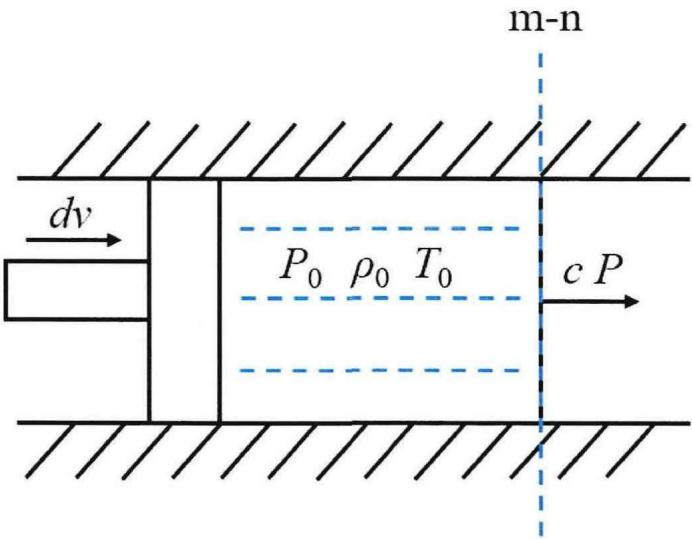\
图 2-1 气体介质中声波传播过程

假设弹性介质为理想流体，小振幅声波在管道中的传递为绝热过程，不产生能量损失，介质在初始静止状态下的压强为 $P_{0}$ ，密度为 $\rho_{0}$ ，温度为 $T_{0}$ ，某一时刻，将声波的影响假设为处在左侧的活塞产生的压缩波，当活塞以 dv 的速度向右方移动，流体微团的体积会减小，引起流体微团压力的增加量为 dP，受到压缩后的这一小部分介质将压力波动不断传播到后侧的流体微团中，因此在管道中形成前进速度为 c、压力为 P 的压缩波。在整个运动过程中，流体密度增量为 $d\rho$ ，假设波面 m-n 为受扰动区域与未受扰动区域的分界面，管道截面面积为 A，根据质量守恒定理可得：

$$
c \rho_ {0} A d t = (c - d v) (\rho_ {0} + d \rho) A d t\tag{2-1}
$$

进行化简可得：

$$
d v = \frac {c d \rho}{\rho_ {0} + d \rho}\tag{2-2}
$$

根据动量守恒原理分析可得：

$$
\frac {(c - d v) - c}{d t} c \rho_ {0} d t = P _ {0} - (P _ {0} + d P)\tag{2-3}
$$

进行化简可得:

$$
d v = \frac {d P}{c \rho_ {0}}\tag{2-4}
$$

对式（2-2）和式（2-3）联立求解可得：

$$
c ^ {2} = \frac {d P}{d \rho} + \frac {d P}{\rho_ {0}}\tag{2-5}
$$

由于介质受到的是微小扰动，所以 $\frac{dP}{\rho_0} \ll 1$ ，此时可将式（2-5）化简为：

$$
c = \sqrt {\frac {d P}{d \rho}}\tag{2-6}
$$

同时运动方程与连续性方程也成立，从而最终可以得出理想声波波动方程：

$$
\frac {\partial^ {2} P}{\partial x ^ {2}} = \frac {1}{c ^ {2}} \frac {\partial^ {2} P}{\partial t ^ {2}}\tag{2-7}
$$

理想气体波动方程说明了声波在理想气体中的传播方式，描述了声波的加速度与声压的空间变化率和时间变化率成正比，因此通过测量声速的变化，是可以判断气体介质种类的差异性的。

结合理想气体状态方程可以推导出理想气体中的声速表达式：

$$
c ^ {2} = \frac {d P}{d \rho} = \frac {\gamma P}{\rho} = \frac {\gamma R T}{M}\tag{2-8}
$$

式中 P —— 气体介质的总压力；

$\rho$ ——气体介质的总密度；

R——普适气体常数，8.314472J·mol $^{-1}$ ·K $^{-1}$ ;

γ——比热容比（定压比热与定容比热之比）；

T —— 绝对温度；

M——气体介质的摩尔分子量。

根据理想气体声速方程，可以发现声速的变化规律，声速与气体介质的特性：比热、摩尔分子量、温度等息息相关。图2-2为几种代表性气体（二氧化碳、甲烷、氮气、氧气和氢气）在标准大气压下的传播速度随环境温度变化的关系图。从图中可以明显看出，随着温度的不断提高，气体介质中的声速逐渐变大，对于不同的气体种类，随着分子量的不断减小，声速会逐渐增大，特别是在同一温度下声波在氢气中传播的速度为 $1300\mathrm{m / s}$ 左右，而在二氧化碳中的传播速度为 $270\mathrm{m / s}$ 左右，这是由于氢气的摩尔分子量远小于二氧化碳，对于氮气和氧气的分子量相差不大就并未出现明显的声速差异。这说明对于摩尔分子量差异较明显的气体，可以利用声速对复杂的气体环境进行测量，测量的准确度远高于分子量相差不明显的气体环境。

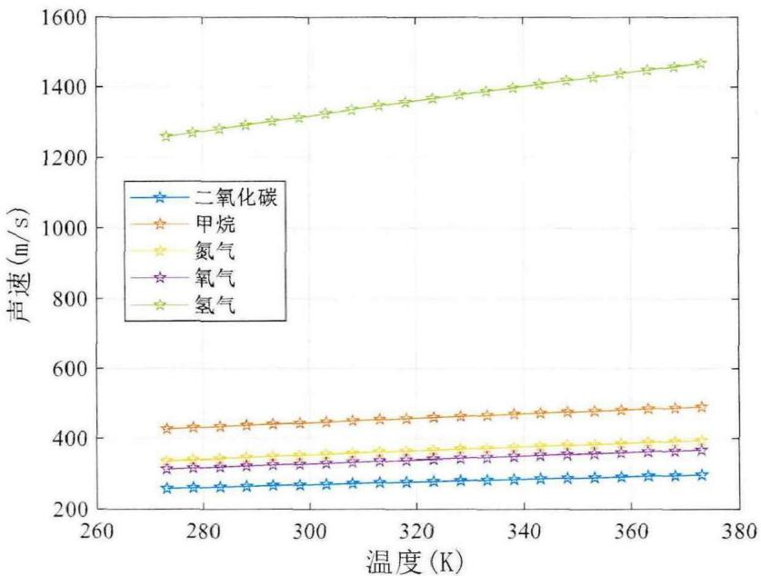\
图 2-2 不同温度条件下声速在二氧化碳、甲烷、氮气、氧气和氢气中的传播规律

## 2.1.2 气体声衰减理论分析

当声波在非理想气体介质中传播时，流体介质中存在黏性阻力，对流体的流动状态、规律、现象有很大的影响，在实际流体中的流动都是非理想流动，对声波的能量产生削弱效果，声波的强度也会随着距离变化不断减小。这是非理想气体环境中出现声波衰减的基本理论基础，则非理想气体的波动方程为以下公式：

$$
\frac {\partial^ {2} \xi}{\partial t ^ {2}} = c ^ {2} \frac {\partial^ {2} \xi}{\partial x ^ {2}} + \nu \frac {\partial^ {3} \xi}{\partial x ^ {2} \partial t}\tag{2-9}
$$

式中 $\xi$ —— 微小的气体单元在声波作用下的位移；

$\nu$ ——动态粘滞系数。

如图 2-3 所示，引起声衰减的主要原因有 $^{[46]}$ ：（1）声波的能量部分被介质吸收导致的吸收损失，在声衰减中占主导地位。（2）在非理想气体中，声波传播时会引起气体分子内部的能量变化，引起分子从激发态到基态（最终平衡状态）的跃迁，在这个过程中涉及到分子内部的能级结构变化和分子之间的碰撞，产生的弛豫过程导致声波能量的衰减。（3）声波在传播时遇到不同的非均匀性气体介质（空气中有灰尘、雾滴等）时，声波的传播方向发生改变，造成了声散射损失。（4）由于声波的扩散导致能量密度的减小，进一步导致能量的减弱。

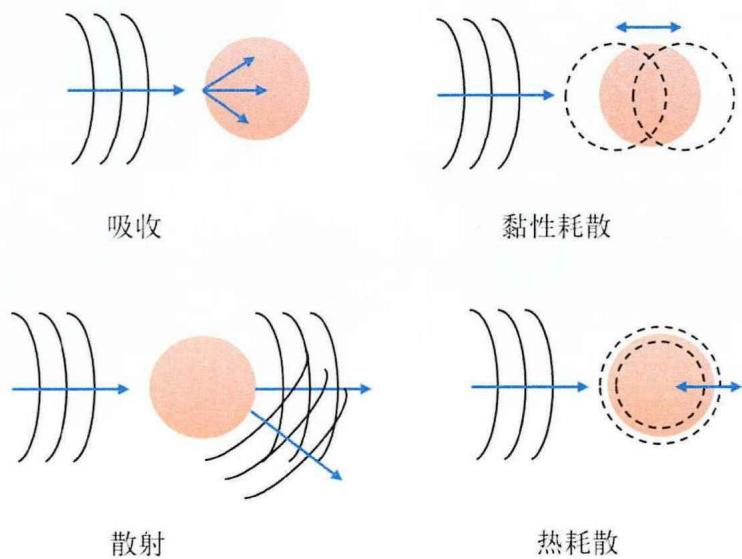\
图 2-3 声波在非理想气体介质中的衰减原理

声波衰减是这些损失机制共同作用、不断叠加的结果，在利用声学特性参数测量气体成分的研究中，假设声波在一定范围内作为平面波，在纯气体介质中传递时，声散射损失可忽略，主要考虑的是声波的吸收损失，包括热传导吸收，粘滞吸收，以及气体分子内能变化造成的声波的吸收，热传导吸收和粘滞吸收属于经典衰减，基于气体分子内能变化造成的能量损失为不可逆的热弛豫现象造成的，属于弛豫衰减。声衰减系数 $\alpha$ 用来描述声波在传播过程中声波能量在单位距离内的削减程度，一般来说，对于特定的介质和频率范围，声衰减系数会随着距离的增加而不断变大，在纯气体介质中，声衰减系数可以用如下公式表示\[47]：

$$
\alpha = \alpha_ {c} + \alpha_ {r}\tag{2-10}
$$

式中 $\alpha_{c}$ —— 经典声吸收系数；

$\alpha_{r}$ ——弛豫声吸收系数。

## 2.1.2.1 经典声衰减过程

气体介质中经典声吸收的产生主要是由于分子物理特性（空间形状、速度、密度等）的变化。

首先是粘滞吸收。由于非理想气体介质具有粘滞性，导致相邻的微元气体分子运动速度不同从而产生速度梯度，成为阻碍流体运动的内摩擦力，即粘滞力，与速度梯度成正比\[48]。当声波在介质中传递时，粘滞作用使得部分的声能转化为热能，主要表现为随着距离声波强度不断减弱，也称为声波的粘滞性衰减，此时的声波衰减系数可以由式（2-11）表示：

$$
\alpha_ {\mu} = \frac {\omega^ {2}}{2 \rho c ^ {3}} \times \frac {4}{3} \mu^ {\prime}\tag{2-11}
$$

式中 $\alpha_{ij}$ —— 粘滞衰减系数；

$\omega$ ——声波角频率；

$\mu$ ——粘滞系数，包括切变粘滞系数和容变粘滞系数，其中切变粘滞系数占主导。衰减粘滞系数与频率的平方成正比，在低频时，粘滞系数很小且基本不变，高频时粘滞系数急剧增大。

其次是热传导吸收。声传播的过程中会出现声波对气体介质做功的现象，介质产生相应的压缩和膨胀，由于整个过程被看作绝热过程，导致膨胀区和压缩区之间形成明显的温度梯度，热量从温度较高的区域（膨胀区）流向温度较低的区域（压缩区），另外，声波的频率越高，产生的温度差越大，热量传递更加明显。分子在空间中不断做着无规则运动，根据热运动的本质，温度被定义为分子的平均动能，更高的温度意味着分子的平均动能更大，因此在膨胀和压缩的循环过程中由于热传导的作用会有声能的损耗，也称为声波的热传导衰减\[49]。此时热传导的声衰减系数方程由式（2-12）表示：

$$
\alpha_ {k} = \frac {k (\gamma - 1) \omega^ {2}}{2 \rho C _ {P} c ^ {3}} = \frac {k \omega^ {2}}{2 \rho c ^ {3}} \left(\frac {1}{C _ {V}} - \frac {1}{C _ {P}}\right)\tag{2-12}
$$

式中 $\alpha_{k}$ —— 热传导衰减系数；

$C_{P}$ ——定压比热容；

$C_{v}$ ——定容比热容；

k——热传导系数。

从式中可以看出，热传导衰减系数与粘滞衰减系数都会随着声波频率的增加而增加，低频声波下分子有足够的时间跟随声波运动，但高频情况下声波的运动周期变短，导致分子之间的摩擦和能量转移加快，声波的能量更多地转化成了热能，这也解释了相对于高频声波，低频声波传播的距离更远，能量的耗散更小。

综上所述，粘滞衰减系数和热传导衰减系数构成了总的经典声衰减系数，即斯托克斯—克希霍夫公式\[50]：

$$
\alpha_ {c} = \frac {\omega^ {2}}{2 \rho c ^ {3}} \left[ \frac {4}{3} \mu^ {\prime} + k \left(\frac {1}{C _ {V}} - \frac {1}{C _ {P}}\right) \right]\tag{2-13}
$$

结合气体介质的密度与摩尔分子量的关系：

$$
\rho = M / 2 2. 4 1 4\tag{2-14}
$$

综合公式（2-8），可将公式（2-13）转化为：

$$
\alpha_ {c} = \alpha_ {\mu^ {\prime}} + \alpha_ {k} = \frac {2 2 . 4 1 4 . 2 \pi^ {2} M ^ {1 / 2} f ^ {2}}{(R T \gamma) ^ {3 / 2}} \left[ \frac {4}{3} \mu^ {\prime} + k \frac {(\gamma - 1)}{C _ {P}} \right]\tag{2-15}
$$

图 2-4 为在标准大气压下，声波频率范围为 10K\~100KHz，气体介质温度为 23℃时，随着声波频率的变化，一氧化碳和氮气的经典声衰减系数变化规律。从图中可以明显看出，两种气体的经典声衰减系数呈近似指数函数趋势增加，当声波频率超过 30KHz 之后，氮气的经典声衰减系数的变化速度更快，衰减现象更加明显。这说明不同的气体测量所需的声波频率具有特殊性，高频时差异会更加显著，这与气体分子本身的质量结构、分子极性等有关。另外，由于一氧化碳和氮气的摩尔分子质量基本一致，气体比热比也近似相等，从声速的测量中无法实现对这两种气体的判断。

因此，经典声衰减系数的测量可以作为补充方法完善对气体成分和浓度的检测研究，确认不同气体的最佳测量频率，可以提高测量方法的准确度以及对不同种类气体反应的灵敏度。

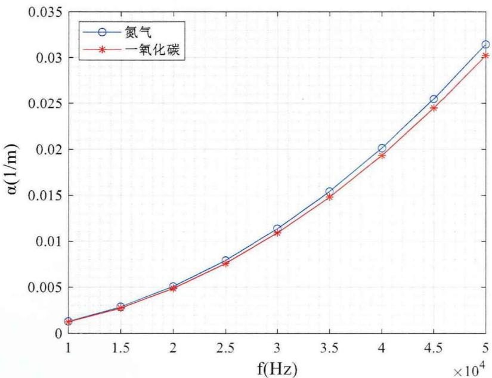\
图 2-4 一氧化碳、氮气的声衰减系数随声波频率的变化关系

## 2.1.2.2 弛豫声衰减过程

通过实验对衰减系数进行测量时发现，测得的衰减系数与计算的经典声衰减系数存在一定的差异性，这说明声波的衰减不止与经典声衰减有关，气体介质内部分子结构和能量的变化也会对声波能量产生影响。

根据分子运动理论，气体介质分子在运动的过程中不仅有整体的平动自由度，组成分子的多个原子也具有相对运动的自由度。分子的运动方式可分为平动、振动和转动三种形式。对于只存在三个平动自由度的单原子分子，在出现能量变化时，由于分子之间的不断相互碰撞进行能量交换，最后会出现新的能量平衡状态。对于多原子分子，除了平动自由度，还有分子内部的振动和转动自由度，具体来说，双原子气体（氮气和氧气）具有三个平动自由度，可以在三个正交方向上自由运动，此外，振动自由度沿着分子轴方向伸缩振动，转动自由度的方向是绕垂直于分子轴方向的转动，双原子分子具有五个自由度；多原子分子通常具有更多的振动模式，对于二氧化碳，包括四个振动自由度，包括对称伸缩振动、不对称伸缩振动和两种弯曲振动，加上平动和转动自由度，二氧化碳分子总共有九个自由度。如图2-5所示，图中展示的为双原子分子的能级变化情况，每个振动能级都具有其对应的转动能级，图中0表征为基态，1表征为第一激发态，2表征为第二激发态，依次类推为更高级的激发态，例如，振动能级0中包含了转动能级0、1、2等，当分子受到激发时，它可以跃迁到更高的振动能级或者在同一个振动能级内跃迁到不同的转动能级，实际分子的能级结构可能会更加复杂，会与分子的具体结构、对称性以及分子间的相互作用有关。

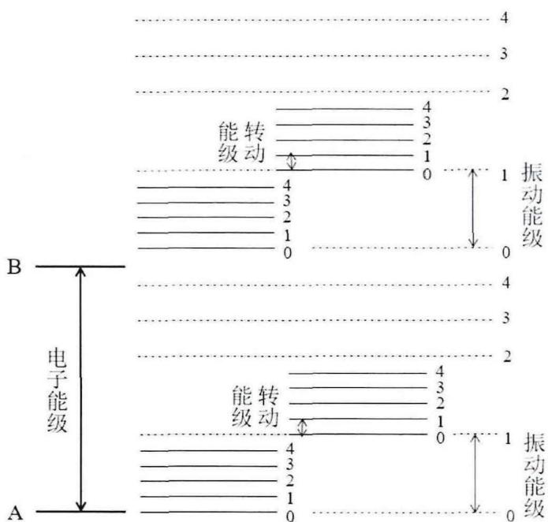\
图 2-5 双原子分子电子、振动和转动的能级示意图

在能量平衡状态时，可将能量均匀地分配到各个自由度中，但当声波在气体介质中传播时，会引起介质局部的压缩和膨胀的循环，在压缩区域气体的温度升高，分子的平动能量增加，会转化为原子进行相对运动的动能，即内自由度的振动和转动能，其中，转动自由度调整的时间更快，而振动自由度的能量转移并不会立即与平动和转动自由度达到平衡，这就意味着气体分子内部能量发生变化，导致声波的内能转化，在高频率下会更加明显，在这个过程中，可能会出现气体原子跃迁到更高的能级，此时能量的变化不可逆转，这一现象称为分子的热弛豫现象，振动自由度调整的时间称为弛豫时间\[51]，另外，气体的弛豫衰减与声波频率密切相关，当声波频率很高时，声波周期与弛豫时间相比很短，弛豫过程无法完成，只有当声波周期与弛豫时间保持一直时，气体介质的弛豫效果实现最大化。分子弛豫衰减的研究完善了声衰减理论的研究，补充了经典声吸收中未考虑到的能量变化，减小计算和测量的误差，对利用声衰减特性进行气体检测提供了更深入的机理分析。

通过对弛豫衰减的形成过程进行分析，得到的气体弛豫衰减系数方程如下：

$$
\alpha_ {r} = \sum_ {i} \frac {\pi D _ {i}}{c} \left[ \frac {\left(f ^ {2} / f _ {i}\right)}{1 + \left(f ^ {2} / f _ {i} ^ {2}\right)} \right]\tag{2-16}
$$

式中 $f_{i}$ —— 待测气体的弛豫频率；

f——声波的振动频率；

$D_{i}$ ——气体分子弛豫强度；

i——气体分子的第 i 种振动模式。

总的来说，对于多原子气体，声波衰减成分既包括经典衰减，也包括弛豫衰减，确定总的气体衰减系数为：

$$
\alpha = \frac {\omega^ {2}}{2 \rho c ^ {3}} \left[ \frac {4}{3} \mu^ {\prime} + k \left(\frac {1}{C _ {V}} - \frac {1}{C _ {P}}\right) \right] + \sum_ {i} \frac {\pi D _ {i}}{c} \left[ \frac {\left(f ^ {2} / f _ {i}\right)}{1 + \left(f ^ {2} / f _ {i} ^ {2}\right)} \right]\tag{2-17}
$$

对于双原子气体，只需采用经典衰减理论进行计算和分析，对于只具有平动自由度的单原子气体，如氩气，也只需考虑经典衰减的影响即可。

## 2.2 气体介质的声学特性测量方法

在实验测量中，需要选择合适的方法对声速和声衰减系数进行测量。对于声速的测量，主要包括 TOF 法与相位差法，TOF 法测量结构简单，测量精度高，响应速度快，并且不会受到温度、湿度、压力等环境特性的影响，适合应用于复杂的气体介质环境中，并且可以检测各种形状和大小，不同距离的物体，相较于相位差法，TOF 法应用更加灵活和广泛。对于声衰减系数的测量，主要是建立声强、声压和电压之间的关系，从而通过测量到的电信号转化为声信号的特征，得到声衰减系数。

## 2.2.1 气体介质声速测量方法

声速测量的基本原理首先要确定发射声信号和接收信号传感器的位置，确定测量距离，测量时间延迟，根据距离和时间的比值关系得到声速，最后对测量结果进行分析和校准，采取必要的补偿措施。目前主要采用互相关时延估计法实现声速的测量，利用信号处理中的互相关原理，主要通过比较两传感器接收到的声波信号来确定它们的时间延迟\[52]。互相关时延估法主要包括两种算法：基本互相关和广义互相关。

## 2.2.1.1 基本互相关

将两个传感器有一定间隔的布置在水平直线上，接收侧的传感器准确地捕获发射的声信号到达时间，将采集到的声信号进行互相关计算，确定与发射信号之间的相似性和时间延迟，就可以确定声波在传感器之间传递所需的时间延迟，这就是基本互相关方法的测量原理。

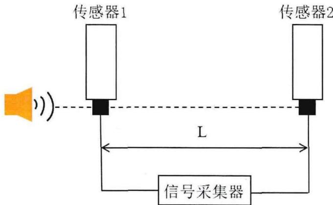\
图 2-6 声信号采集过程

如图 2-6 所示。传感器 1 和传感器 2 之间的距离用 L 表示，声源向传感器 1 发射信号，传感器 2 接收到信号，声波信号沿着这条路径单向传播，它们采集到的声信号可以表示为：

$$
\chi_ {1} (n) = s (n) + \omega_ {1} (n)\tag{2-18}
$$

$$
\chi_ {2} (n) = \alpha s (n - D) + \omega_ {2} (n)\tag{2-19}
$$

式中 $\chi_{1}(n)$ 、 $\chi_{2}(n)$ ——传感器 1、2 采集到声信号数学模型；

$s(n)$ ——声源信号函数；

D——时间延迟；

$\omega_{1}(n)$ 、 $\omega_{2}(n)$ ——传感器1、2接收到的噪声数学模型。

两个声信号的互相关函数可表示为：

$$
R _ {\chi_ {1}, \chi_ {2}} (\tau) = E [ \chi_ {1} (n) \chi_ {2} (n + \tau) ]\tag{2-20}
$$

由于互相关函数是两个信号之间乘积的积分，当一个信号相对于另一个信号滑动时，在不同的相对滑动位置会有不同的积分值，当两个信号高度相似且时延时间合适时，互相关函数会产生明显且唯一的峰值，找到峰值点对应的时延点数进行计算，就可以得到声波信号传播的时间延迟：

$$
D = \arg \left\{\max \left[ R _ {\chi_ {1} \cdot \chi_ {2}} (\tau - D) \right] \right\}\tag{2-21}
$$

## 2.2.1.2 广义互相关

在实际的工程应用中，选择适当的互相关算法取决于具体的应用场景和测量要求。基本互相关算法在进行测量时，可能会受到背景噪声、多路径传播等因素的干扰，为了能够提高复杂环境中测量的鲁棒性和准确性，广义互相关算法通过采用相位修正、加权、多通道处理、自适应滤波、时频域分析等方法更可靠地进行时延估计。广义互相关涉及将声信号从时域转化为频域，并利用频域信息计算声信号之间的相互关系得到信号函数，之后提前对它进行滤波处理（加权计算），降低噪声的影响，提高声源信号在信噪比中的占比，这种方法更加灵活并且可以更好地适应复杂的环境。

广义互相关函数的数学模型为：

$$
\begin{array}{l} R _ {y _ {1}, y _ {2}} (\tau) = F ^ {- 1} \left[ G _ {y _ {1}, y _ {2}} (f) \right] = F ^ {- 1} \left[ \psi (f) G _ {y _ {1}, y _ {2}} (f) \right] \\ = \int_ {- \infty} ^ {\infty} \psi (f) G _ {\chi_ {1}, \chi_ {2}} (f) e ^ {j 2 \pi f \tau} d f \end{array}\tag{2-22}
$$

$$
G _ {\chi_ {1}, \chi_ {2}} = F ^ {*} [ \chi_ {1} (n) ] F [ \chi_ {2} (n) ]\tag{2-23}
$$

式中 $F^{-1}$ —— 傅里叶逆变换；

$\psi$ ——加权函数；

\* —— 共轭；

F——傅里叶变换。

采用不同种类的加权函数可以进一步改进广义互相关函数，加权函数的类型的选择取决于信号类型，环境噪声和混响的特性以及特定应用的要求等因素，可以使得互相关函数中的峰值更加明显，提高广义互相关函数的精确性和可靠性。ROTH 加权通常用于在环境中存在噪声和混响的情况中，可以提高峰值的显著性；SCOT 加权用于降低信号在受到噪声干扰时可能出现的伪峰，在高噪声情况下表现出更高的稳健性，PAHT 加权在存在多路径传播和剧烈混响的情况下表现良好，Eckart 加权也是一种适用于特殊情况的加权函数，具有较强的抗干扰性，它们的权函数如表 2-1 所示，在实际应用中，需要根据具体的应用需求和环境特性对比不同加权函数的性能进行选择。

表 2-1 广义互相关的加权函数

| <!-- --> | <!-- --> | <!-- --> |
| -- | --------- | --------------------------------------------------------------- |
| 序号 | 名称        | 权函数                                                             |
| 1  | 基本互相关     | 1                                                               |
| 2  | Roth 加权   | $\frac{1}{G\_{\chi\_1\chi\_1}(f)}$                              |
| 3  | SCOT 加权   | $\frac{1}{\sqrt{G\_{\chi\_1\chi\_1}(f)G\_{\chi\_2\chi\_2}(f)}}$ |
| 4  | PHAT 加权   | $\frac{1}{\|G\_{\chi\_1\chi\_2}(f)\|}$                          |
| 5  | Eckart 加权 | $\frac{G\_{s\_1s\_2}(f)}{G\_{n\_1n\_1}(f)G\_{n\_2n\_2}(f)}$     |

经过大量的实验研究和理论分析，采用 PHAT- $\beta$ 加权方法，在原有的 PHAT 加权方法上增加了指数次系数常数 $\beta$ ，可以弥补其他方法在测量过程中出现的不足，更加适用于电站中声波信号的提取，抗干扰性强，测量精度和稳定性都更高具有更高的实际应用价值。PHAT- $\beta$ 加权函数表示为：

$$
\psi = \frac {1}{\left| G _ {\chi_ {1} \chi_ {2}} (f) \right| ^ {\beta}}\tag{2-24}
$$

如图 2-7 展示了 PHAT- $\beta$ 互相关算法的简要流程，两个传感器接收到的声信号转化为数字信号，通过滤波、降噪等步骤进行预处理，之后进行傅里叶变换（FFT），计算互功率谱取得共轭，然后对其进行 PHAT- $\beta$ 加权，再通过反傅里叶变换（IFFT）将计算从频域换回时域，得到 PHAT- $\beta$ 互相相关函数，最终得到函数的峰值点对应的声波在介质中传播的时间延迟。

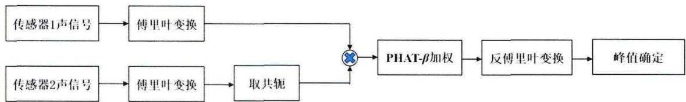\
图 2-7 PHAT- $\beta$ 加权广义互相关算法流程图

## 2.2.2 气体介质声衰减测量方法

在声场中，声强是描述声波能量传播强度的物理量，以每单位面积的能量流量表示，方向垂直于声波的传播方向。当声波在非理想气体介质中传播时，根据声波衰减理论可知，声强会随着声波传播距离的增加不断减小，因此发射声波与接收声波之间的关系可以表示为：

$$
I = I _ {0} e ^ {- \alpha x}\tag{2-25}
$$

式中 $I_0$ ——发射端声强；

x——声波的传播距离;

I —— 距离在 x 处接收端声强。

而在声学测量中，声强通常不易测量，通常需要测出的声压换算求得，在声场中，声压和声特性阻抗都会影响声强的大小,声强与声压的平方成正比，与媒介特性阻抗成反比：

$$
I = \frac {P ^ {2}}{2 Z}\tag{2-26}
$$

式中 $P$ ——声压；

z——媒介特性阻抗是声波在介质中传播时，介质对声波传播的阻力，与介质的密度和声速有关。

由于超声换能器的核心是压电陶瓷，具有压电效应，产生的超声波方向性强，基本可以看作平面波，声压与电压之间存在线性关系，即：

$$
P = a U\tag{2-27}
$$

式中 $U$ ——测量电压；

a——比例系数。

综上所述，结合公式（2-25）、（2-26）和（2-27），可以得到电压与声衰减系数之间的关系：

$$
2 \ln U = \alpha x + 2 \ln U _ {0}\tag{2-28}
$$

式中 $U_{0}$ ——发射端电压；

$U$ ——距离在 $x$ 处接收端电压。

从公式中明显可以看出，声衰减系数 $\alpha$ 为公式（2-28）的斜率，通过测得的电压变化可以得出声波的衰减情况。

## 2.3 本章小结

本章主要分析了声波在气体介质中的传播特性并介绍了第四章中实验所需的声速测量和声衰减系数测量方法，主要包括：

（1）根据声波在气体介质中的传播特性，选择声速和声衰减系数这两个声学特征参数作为检测依据，为之后分析多元混合气体组分奠定理论基础并进行了初步的计算。第一部分研究了气体介质的物性参数与声波传播速度的关系，根据理想气体声速方程，分析了不同种类气体在不同温度下声速的变化情况，验证了利用声速进行气体检测的可行性；第二部分对非理想气体介质中的声波衰减过程进行分析，介绍超声衰减的类型并计算了声衰减系数，对比了摩尔分子质量相近的气体衰减程度，说明了声衰减气体检测方法具有更好的适用性，可以弥补声速检测的不足。

（2）对实验中要采用的声学特征参数的测量方法进行介绍，对比了基本互相管、广义互相关以及广义互相关中不同的加权函数的应用场景和测量准确度，采用 PHAT- $\beta$ 加权互相关算法，另外介绍了声衰减系数的测量方法，通过传感器输出的电压进一步计算出声波在传播过程中的衰减信息。

## 第 3 章 多元混合气体的声传播特性研究

常规对多元混合气体中的检测方式是使用多传感器测量系统，使用多个不同类型的传感器，每个传感器对特定的气体组分发生相应的物理或化学反应，确定气体成分；或者布置传感器阵列，选择一组具有不同选择性的传感器，通过模式识别算法可以对气体组分进行准确的识别和定量分析，但这些方法都需要对采集到的不同类型的数据进行归一化处理才便于分析，计算复杂耗时，因此采用单一传感器进行多元混合气体分析具有广阔的应用前景。

利用声学特性进行多元混合气体检测可以实现测量采集、数据处理的便捷性和归一化。本章的研究主要分为两个部分，第一部分为多元混合气体中声速的计算和声衰减系数的计算，之后建立多元混合气体的浓度与经典衰减、声速的关系模型，实现多组分气体的成分分析，第二部分采用数值模拟的方法，对整个测量环境的浓度场利用声学特性参数进行重建，判断气体组分的分布，为第四章中的实验设计和实验方案提供思路。

## 3.1 多元混合气体声学特性参数的计算

## 3.1.1 多元混合气体声速模型

当两种纯净的气体混合后，混合气体的摩尔分子量和比热容比为单一气体的加权和，在给定其中一种气体的浓度情况下，确定混合气体的物性参数，此时可以将声速表示为：

$$
C = \sqrt {\frac {R T}{w M _ {1} + (1 - w) M _ {2}} \left(\gamma_ {2} + w \gamma_ {1} - w \gamma_ {2}\right)}\tag{3-1}
$$

式中 w —— 给定气体成分占比；

$M_{1}$ 、 $M_{2}$ ——被测气体、背景气体的摩尔分子量；

$\gamma_{1}$ 、 $\gamma_{2}$ ——被测气体、背景气体的比热容比。

当多种气体混合时，声速关系表示为：

$$
C = \sqrt {\frac {R T}{\sum_ {i = 1} w _ {i} M _ {i}} \sum_ {i = 1} w _ {i} \gamma_ {i}}\tag{3-2}
$$

不同成分和浓度的气体混合时，超声波声速会发生改变。图 3-1 反映的是当温度为 $25^{\circ}$ C 时，以氮气作为背景气体，被测气体分别为氧气、甲烷、二氧化碳、一氧化碳和氢气时，超声波的声速随着被测气体浓度增大的变化趋势。从图中可以明显看出，由于氢气的声速变化最为明显，随着浓度的增加声速呈近似指数关系上升，这是由于声速与气体的密度和压缩性有关，氢气的分子量远小于背景气体氮气，当氢气的占比增加时，混合气体中总的声速迅速发生明显变化。氧气、二氧化碳与氮气混合气体中的声速随着浓度的增加不断减小，在甲烷与氮气混合气体中的声速随着浓度的增加不断增大，而一氧化碳与氮气的混合气体中，随着浓度的变化声速基本保持不变，它们的浓度与声速都近似成线性关系。

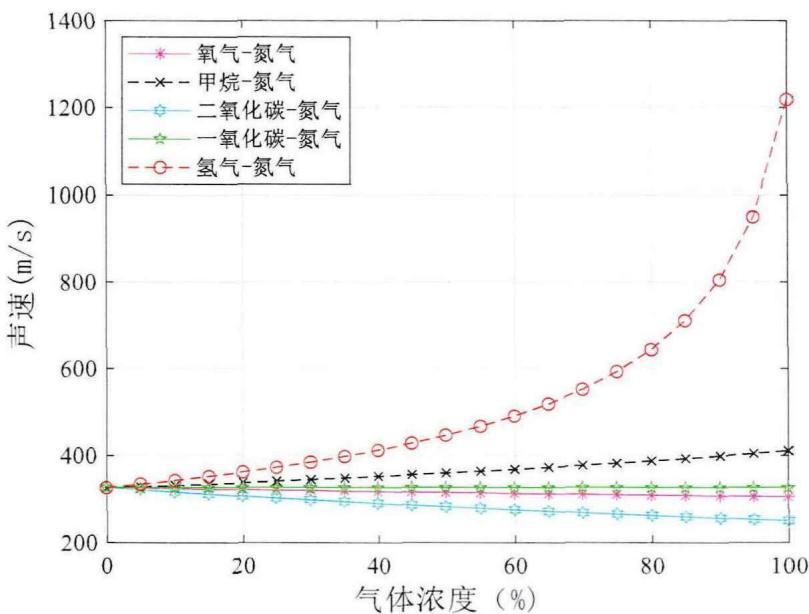\
图 3-1 多组二元混合气体（氮气为背景气体）中声速与浓度的对应关系

这说明声速变化的快慢主要是根据被测气体与背景气体的分子量之间的关系决定的，特别的一氧化碳和氮气的分子量基本一致，所以只利用声速无法判断它们的浓度占比。

## 3.1.2 多元混合气体声衰减模型

对于单原子分子和双原子分子，声波衰减主要集中在经典声衰减部分。根据公式（2-13）可以确定影响经典声衰减系数的关键因素：密度、热传导系数、定压比热容、粘滞系数、定容比热容。同样可以按照多元混合气体中的成分占比得到这些影响因素的总的数值，因此混合气体中的经声典衰减关系式应该表示为：

$$
\alpha_ {c} = \frac {\omega^ {2}}{2 \rho_ {m i x} c ^ {3}} \left[ \frac {4}{3} \mu_ {m i x} ^ {\prime} + k _ {m i x} \left(\frac {1}{C _ {V} ^ {m i x}} - \frac {1}{C _ {P} ^ {m i x}}\right) \right]\tag{3-3}
$$

式中 $\rho_{mix} = \sum_{i=1}^{n} w_i \rho_i$ —— 混合气体的密度， $k_i$ 表示第 $i$ 种气体的密度；

$C_{V}^{mix}=\sum_{i=1}w_{i}C_{V}^{i}$ —— 混合气体的定体比热容， $C_{V}^{i}$ 表示第 i 种气体的定体比热容；

$C_{P}^{mix}=\sum_{i=1}w_{i}C_{P}^{i}$ —— 混合气体的定压比热容， $C_{V}^{i}$ 表示第 i 种气体的定压比热

容；

$k_{mix}=\sum_{i=1}w_{i}k_{i}$ ——混合气体的热传导系数， $k_{i}$ 表示第i种气体的热传导系数；

$\mu_{mix}=\sum_{i=1}w_{i}\mu_{i}$ —— 混合气体的粘滞系数， $\mu_{i}$ 表示第 i 种气体的粘滞系数；

$\sum_{i=1}w_{i}=1$ ——每种气体的成分占比为 $w_{i}$ ，总成分为1。

因此，结合公式（2-15），公式（3-3）可以进一步表示为：

$$
\alpha_ {c} = \frac {2 2 . 4 1 4 . 2 \pi^ {2} \left(\sum_ {i = 1} w _ {i} M _ {i}\right) ^ {1 / 2} f ^ {2}}{\left(R T \sum_ {i = 1} w _ {i} \gamma_ {i}\right) ^ {3 / 2}} \left[ \frac {4}{3} \sum_ {i = 1} w _ {i} \mu_ {i} + \sum_ {i = 1} w _ {i} k _ {i} \frac {\left(\sum_ {i = 1} w _ {i} \gamma_ {i} - 1\right)}{\sum_ {i = 1} w _ {i} C _ {P} ^ {i}} \right]\tag{3-4}
$$

这就是多元混合气体的经典声衰减模型。通过实验测得的声衰减系数，可以逆向推出此时的气体组分。在实际计算的过程中，各组分气体随着环境的变化自身的物性参数也会发生变化，因此现需要对气体的热传导系数和粘滞系数针对实际情况进行修正计算。

对于粘滞系数可按照经验公式进行修正 $^{[53]}$ :

$$
\mu_ {i} ^ {\prime} = \mu_ {i 0} ^ {\prime} \frac {2 7 3 . 1 5 + c}{T + B} (\frac {T}{2 7 3 . 1 5}) ^ {3 / 2}\tag{3-5}
$$

式中 $\mu_{i0}$ —— $0^{\circ}C$ 时第 i 种气体组分的粘滞系数；

B——与气体种类有关的常数。

对于热传导系数可以通过修正公式来估算 $^{[54]}$ :

$$
k _ {i} = k _ {i 0} \left(\frac {T}{2 7 3 . 1 5}\right) ^ {m}\tag{3-6}
$$

式中 $k_{i0}$ —— $0^{\circ}C$ 时第 i 种气体组分的导热系数；

m——与气体种类有关的常数。

当环境温度为 $20^{\circ}C$ ，标准大气压下，混合气体中只有两种纯净的气体组分时，以氮气为背景气体，通过改变氧气的浓度研究混合气体中声衰减系数的变化，其变化规律如图 3-2 所示，从图中可以明显看出，随着氧气浓度的增加，声衰减系数不断增大，这说明氧气对声波能量的吸收效果更强。

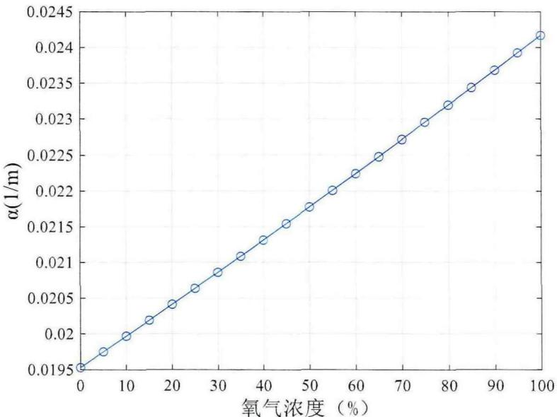\
图 3-2 氧气浓度变化（氮气为背景气体）与声衰减系数的关系

## 3.1.3 声衰减与声速结合检测气体的计算模型

根据已经建立的声速模型和声衰减模型，进行数值模拟确定气体浓度、声速和声衰减之间的关系，进而建立多元混合气体浓度检测的数学模型。在环境温度为 $20^{\circ}C$ ，标准大气压条件下，以氮气为背景气体，混合不同比例条件下的氧气和氢气，三种气体均为双原子气体，总的声速和声衰减系数与气体浓度的关系如图 3-3 所示。

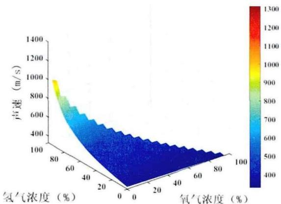\
a)声速变化

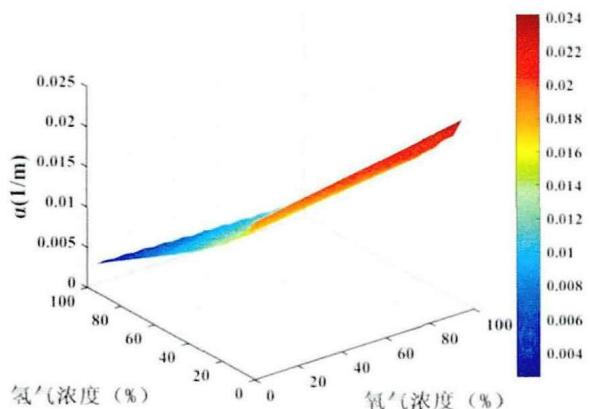\
b)声衰减系数变化\
图 3-3 声速和声衰减系数随氮气、氢气、氧气混合气体浓度的变化关系

图 3-3 中 x 轴代表氢气的浓度变化，y 轴代表氧气的浓度变化，z 轴分别表示声速和声衰减系数的变化情况，从图 3-3 a) 中可以明显看出，总的声速随着氢气浓度的增加不断变大，而随着氧气浓度的增加，总的声速减小。整个变化过程中声速在 329m/s-1025m/s 范围内，这是由于氢气的分子量远小于氮气，氧气的分子量大于氮气，当氧气成分不断增加时，声速减小。在图 3-3 b) 中，随着氢气浓度的升高，混合气体的衰减系数不断减小，而随着氧气浓度的增加，衰减强度剧烈上升，衰减系数范围在 0.0034-0.024 之间。如果在声速的三维空间图中做一声速为 383.87m/s 平面，就可以找到混合气体中声速在 383.87m/s 时对应氢气和氧气的二维曲线；另外做声衰减系数为 0.015 的水平面与声衰减曲面相交形成曲线，即声衰减系数为 0.015 时对应的氢气和氧气的二维曲线，将这两条曲线投影到水平面上，得到这两条曲线的交点就可以确定此时的氢气和氧气的浓度占比，进一步得到氮气的浓度。

图 3-4 展示了上述的两条曲线投影到水平面得到的交点位置关系。这两条曲线的交点是声速为 383.87m/s，声衰减系数为 0.015 时对应的氢气浓度和氧气的浓度，此时氢气和氧气的浓度均在 20% 左右，氮气的浓度为 60%。综合上述的数值模拟，确定基于混合气体组分占比的计算方法可以实现多元混合气体的成分和浓度的分析，可以进一步通过模拟的方法判断模型的准确度。

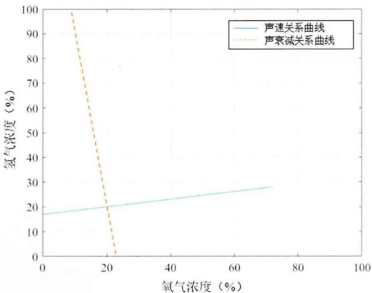\
图 3-4 氮气、氢气和氧气中给定声速和声衰减在水平面的投影曲线

## 3.2 多元混合气体浓度场的重建

通过对多元混合气体中声传播特性进行的数值计算，得到了声速和声衰减系数与混合气体浓度的关系，提出了利用这两个声学特性参数反推出混合气体浓度的方法。为了进一步对声波在多元混合气体中的传播特性的研究和验证，本文采用 MATLAB 对浓度场进行了重建。

## 3.2.1 声学重建中的局部热平衡

在声学重建的研究中，用声学法对浓度场进行测量时，由于存在传递现象，在测量的过程中会出现物质和能量不平衡的状态，存在浓度梯度，而声学测量只有在物理参数保持平衡状态时才有意义，遵从牛顿运动定律和质量守恒定律。为使声学重建结果更加合理真实，简化声学模型的建立和分析过程，需要对混合气体及声波传播过程做如下假设：

（1）混合气体介质中声波的传递会引起分子的碰撞和宏观能量的变化，进而引起分子内部能量的变化和迁移，导致弛豫现象和弛豫时间的出现，根据局部热平衡理论，外部物理参数的变化决定了气体在宏观上的状态，为尽可能降低微观尺度对宏观状态的影响，重建过程中宏观物理量的尺度要远大于分子内部时间和空间的变化尺度。

声学测量满足局部热平衡假设主要包括两个原因，声波在传播过程中引起混合气体中的局部物理参数的周期性变化，如密度、温度、压力等，而这些局部变化相对于外部宏观物理量的变化可以忽略的，这说明局部物理参数变化影响的微小性，可将整体中的每个局部物理量视作是均匀的。另一方面，声波会导致气体分子的压缩和膨胀产生声弛豫现象，大部分的多原子分子弛豫时间的尺度小于 $10^{-6}$ 秒\[55]，相比之下，外部宏观物理量的变化时间通常远远大于这个尺度，因此，从宏观角度来看声弛豫现象可被视作迅速发生的，不受外部宏观物理量变化的影响。综合宏观和微观物理量在时间和空间上都互相不影响彼此的变化，这说明声学检测技术可以满足局部平衡假设的条件\[56]。

（2）混合气体中的成分是稳定的，并且化学反应的速率相对较低，根据局部热平衡理论，气体分子之间的能量转移率要比化学反应速率高很多，因此，可以合理的假设混合气体分子之间不发生化学反应。

综上所述，在进行声学重建时，将整个区域离散为若干个小区域，假设每个小区域内的物理参数都是均匀的，通过测量声波在每个小区域中的传播情况，推断出每个小区域内的气体特性，结合整个区域的离散化，重建每个小区域内的声学特征参数，从而得到整个测量区域的浓度场。

## 3.2.2 无噪声下浓度场的声学重建

利用声学法对浓度场进行重建的原理，首先是获得声波在多条有效路径上的传播时间，对其进行积分后得到声波在每条路径上的声程，将上文中建立的声速、声衰减和气体浓度之间的模型于 TOF 测量结果相结合，构建一个反问题模型并进行求解，从而得到整个测量区域的浓度分布。本研究采用区域离散法进行建模，利用若干网格划分测量区域，根据局部热平衡理论，每个网格中的气体浓度是稳定不变的，选择合适的算法计算 TOF 数据得到声速的分布，将声速场转化为浓度场做初步估算，得到整个测量区域内的粗略浓度场分布，之后利用插值算法细化网格，将插值得到的浓度场拟合到连续的函数模型中，从而得到连续的浓度场。

本文选用 $6m \times 6m \times 6m$ 的立方体进行三维浓度场的重建，温度恒定为 303.15K，选择二元混合气体进行重建。将待测区域平均剖分为 27 个网格，在立方体四周均匀地布置超声波换能器阵列，每条棱线上均布置 3 个，每个面的中心点布置 1 个，共 20 个超声波换能器，有效声波传播路径为 58 条，图 3-5 展示了超声换能器的布置和声传播路径的分布。

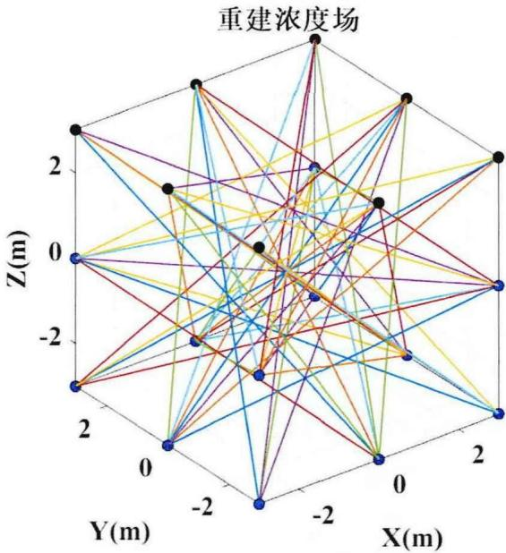\
图 3-5 超声波换能器阵列布置及声传播路径

每条声波传播路径上的 TOF 数据可表示为：

$$
t _ {i} = \sum_ {j = 1} ^ {2 7} S _ {i j} A _ {j}, i = 1, 2, \dots , 5 8\tag{3-7}
$$

式中 $S_{ij}$ ——第 $i$ 条声传播有效路径通过第 $j$ 个网格的截距；

$A_{ij}$ ——第j个网格中声速的倒数。

对每条声波传播路径 27 个网格的时间求和就可以得到该条传播路径的总时间，经过周期性测量后，58 条声波传播路径的线性方程组为：

$$
\left\{ \begin{array}{l} S _ {1, 1} A _ {1} + S _ {1, 2} A _ {2} + \dots + S _ {1, 2 7} A _ {2 7} = t _ {1} \\ S _ {2, 1} A _ {1} + S _ {2, 2} A _ {2} + \dots + S _ {2, 2 7} A _ {2 7} = t _ {2} \\ \vdots \\ S _ {5 8, 1} A _ {1} + S _ {5 8, 2} A _ {2} + \dots + S _ {5 8, 2 7} A _ {2 7} = t _ {5 8} \end{array} \right\}\tag{3-8}
$$

该线性方程组的矩阵表示方式为：

$$
V x = b\tag{3-9}
$$

式中 $V_{58\times27}=\begin{pmatrix}S_{1,1}&\cdots&S_{1,27}\\ \vdots&\ddots&\vdots\\ S_{58,1}&\cdots&S_{58,27}\end{pmatrix}$ —— 重建系数矩阵；

$x=(A_{1},A_{2},\cdots,A_{58})^{T}$ —— 声速倒数向量；

$b=(t_{1},t_{2},\cdots,t_{27})^{T}$ —— TOF 数据向量。

本文采用最小二乘法（Least Squares Method，LSM）求解超定方程组，它主要是根据 TOF 的测量值与 TOF 的真实值之间误差的平方和最小时，得到与测量数据匹配的最佳函数，用数学模型表示为：

$$
\min \sum_ {i = 1} ^ {5 8} \left| t _ {i r} - t _ {i} \right| ^ {2}\tag{3-10}
$$

式中 $t_{ir}$ —— 第 i 条声传播有效路径实际测量传播时间；

$t_{i}$ —— 第 i 条声传播有效路径计算的传播时间。

将公式（3-7）代入公式（3-10）可得：

$$
\min \sum_ {i = 1} ^ {5 8} \left| t _ {i r} - \sum_ {j = 1} ^ {2 7} S _ {i j} A _ {j} \right| ^ {2}\tag{3-11}
$$

令公式（3-11）的导数为0，即可得到其最小值：

$$
\frac {\partial}{\partial A _ {j}} \sum_ {i = 1} ^ {5 8} \left| t _ {i r} - \sum_ {j = 1} ^ {2 7} S _ {i j} A _ {j} \right| ^ {2} = 0\tag{3-12}
$$

将上式按照式（3-9）的矩阵形式来表示为：

$$
V ^ {T} V x = V ^ {T} b\tag{3-13}
$$

由式（3-13）可得式（3-9）的最小二乘解为：

$$
x = \left(V ^ {T} V\right) ^ {- 1} V ^ {T} b\tag{3-14}
$$

在评估待测浓度场的重建质量，进行误差分析时，最大相对误差、平均相对误差和均方根误差是常用的评价指标，以下是这三个指标的计算公式：

$$
E _ {\max} = \max \left| \frac {u _ {j} ^ {\prime} - u _ {j}}{u _ {j}} \right| \times 100 \%\tag{3-15}
$$

$$
E _ {a v e} = \frac {1}{2 7} \sum_ {j = 1} ^ {2 7} \left| \frac {u _ {j} - u _ {j}}{u _ {j}} \right| \times 100\%\tag{3-16}
$$

$$
E _ {r m s} = \frac {\sqrt {\frac {1}{2 7} \sum_ {j = 1} ^ {2 7} (u _ {j} ^ {'} - u _ {j}) ^ {2}}}{u _ {a v e}} \times 100 \%\tag{3-17}
$$

式中 $u_{j}$ 、 $u_{j}$ ——重建浓度场、真实浓度场中的第 j 个网格中心点的气体浓度；

$u_{ave}$ —— 真实浓度场中的平均浓度。

综上所述，对给定区域的浓度场进行细化重建，选择了单峰对称，单峰偏置，双峰对称这三种模型对二氧化碳-氮气混合气体的分布进行了重建，重建结果如图 3-6 所示，从图中可以看出，三种重建浓度场的浓度分布及变化趋势与模型浓度场基本一致。

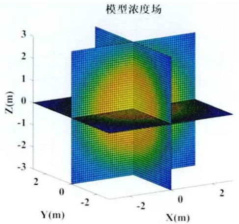\
a)单峰对称模型浓度场 模型浓度场

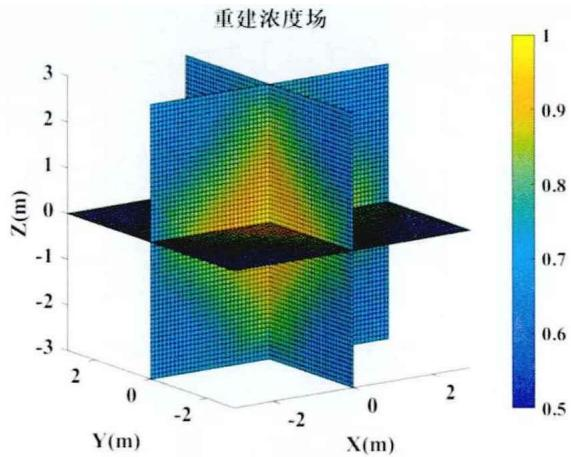\
b)单峰对称重建浓度场

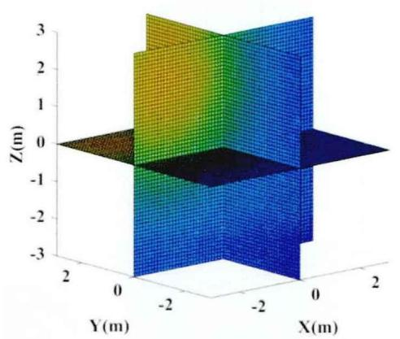\
c)单峰偏移模型浓度场 模型浓度场

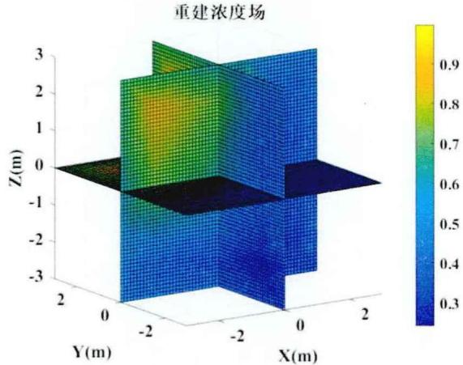

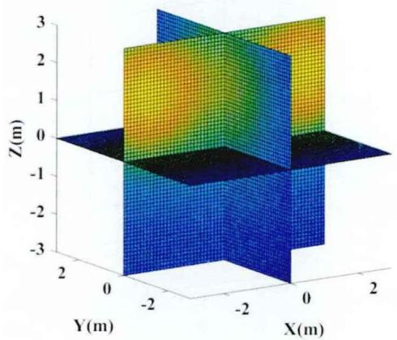\
e) 双峰对称模型浓度场

d)单峰偏移重建浓度场 重建浓度场\
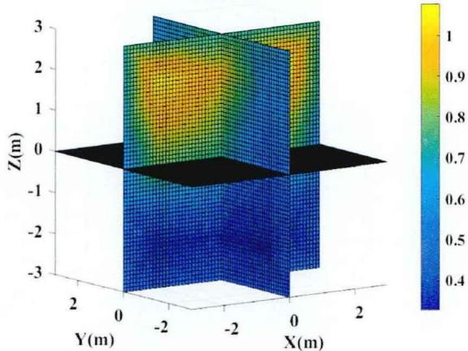\
f)双峰对称重建浓度场\
图 3-6 基于声速测量的二氧化碳浓度分布

此时对不同模型下的模型浓度场和重建浓度场之间的误差进行分析，对无噪声工况下的浓度场重建质量进行评估，分析结果如表 3-1 所示。表中数据显示：对比不同浓度场模型重建得到的误差，双峰对称模型的重建误差要略大于单峰模型重建的误差，这是由于双峰模型的浓度场更加复杂，但网格的数目并未随之增大。通过误差分析验证了本文中提出的声学测量方法的准确性，重建浓度场最小的平均相对误差为 0.21%。

表 3-1 二氧化碳浓度分布重建误差(%)

| <!-- --> | <!-- --> | <!-- --> | <!-- --> |
| ------ | ------ | ------ | ----- |
|        | 最大相对误差 | 平均相对误差 | 均方根误差 |
| 单峰对称模型 | 4.32   | 0.45   | 11.79 |
| 单峰偏置模型 | 1.88   | 0.21   | 12.95 |
| 双峰对称模型 | 2.37   | 8.55   | 17.90 |

## 3.2.3 噪声下浓度场的声学重建

在实际的工程应用中，测量结果常常会受到周围环境噪声的影响，比如电子设备的干扰或者传感器的噪声，在信号传输和采集的过程中叠加在原始信号上，考虑噪声的影响，可以更加准确的恢复原始信号或图像的质量，进行重建算法抗干扰性的分析。因此，本节对重建浓度场的抗噪性能进行研究，对单峰模型测量数据添加一个均值为0，标准差为 $\sigma$ 的高斯白噪声，将标准差 $\sigma$ 的值从0.01以0.02的间隔增大到0.14，并对它们分别进行浓度场重建，重建结果如图3-8所示。从图中可以看出，重建浓度场中的二氧化碳分布与模型浓度场的分布基本一致，随着标准差 $\sigma$ 的增大，二氧化碳的分布范围不断缩小，当 $\sigma=0.14$ 时，二氧化碳的高浓度分布区域急剧扩大，与模型浓度场的分布产生很大差异性，这说明，当标准差在0.14范围内时，重建浓度场的抗干扰性较高。

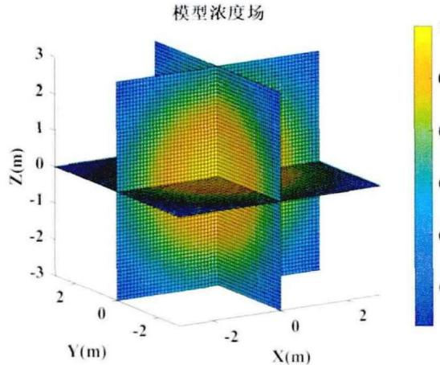\
a) 模型浓度场

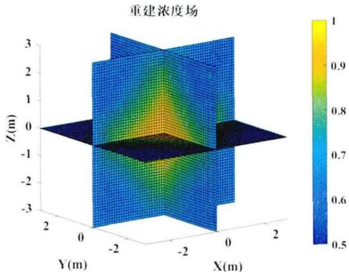\
b) $\sigma = 0.02$ 重建浓度场

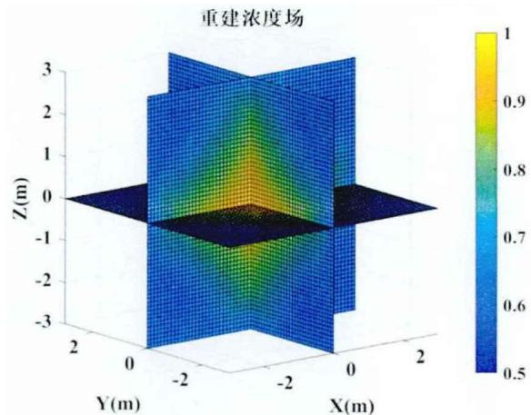\
c) $\sigma = 0.04$ 重建浓度场

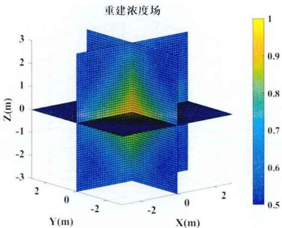\
d) $\sigma=0.06$ 重建浓度场

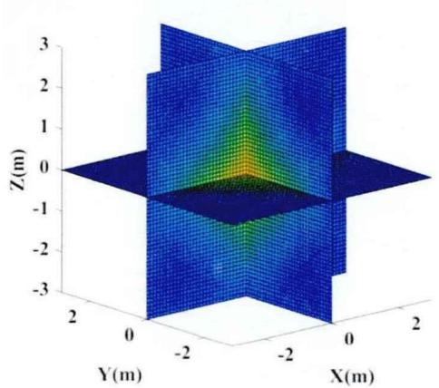\
e) $\sigma=0.08$ 重建浓度场

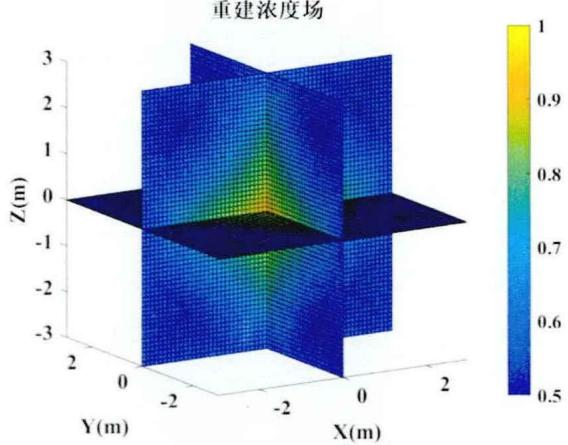\
f) $\sigma = 0.10$ 重建浓度场

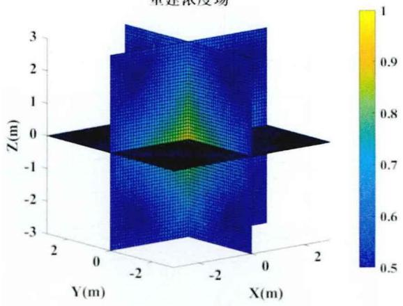\
g) $\sigma=0.12$ 重建浓度场

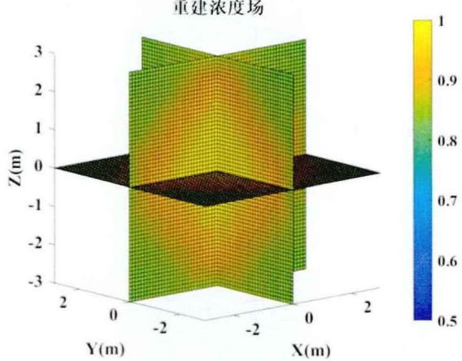\
h) $\sigma = 0.14$ 重建浓度场\
图 3-7 重建浓度场中二氧化碳的分布随不同高斯白噪声的变化关系

进一步对不同标准差下的重建浓度场与模型浓度场之间的绝对误差进行分析，如图 3-8 所示，从图中可以定性看出，标准差在小于 0.14 时，二氧化碳分布的绝对误差多集中在 0\~0.2 的蓝色区域，随着标准差的增大，测量受到噪声的影响不断增大。

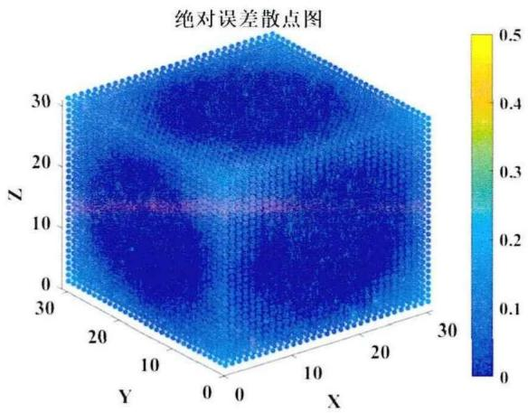\
a) $\sigma = 0.02$

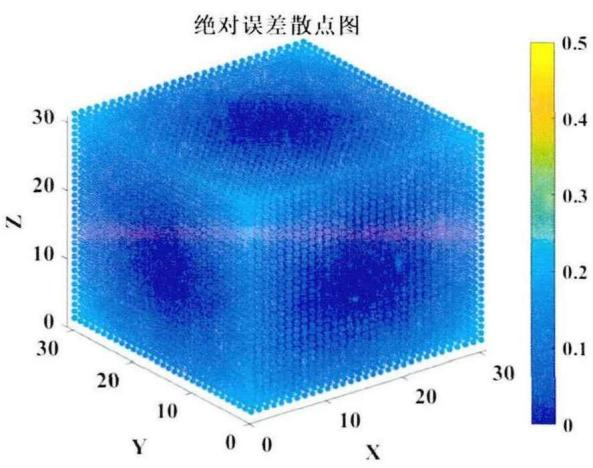\
b) $\sigma=0.04$

绝对误差散点图\
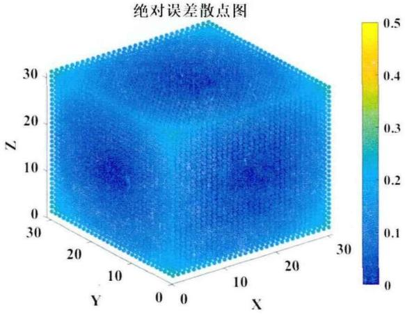\
c) $\sigma=0.06$\
绝对误差散点图

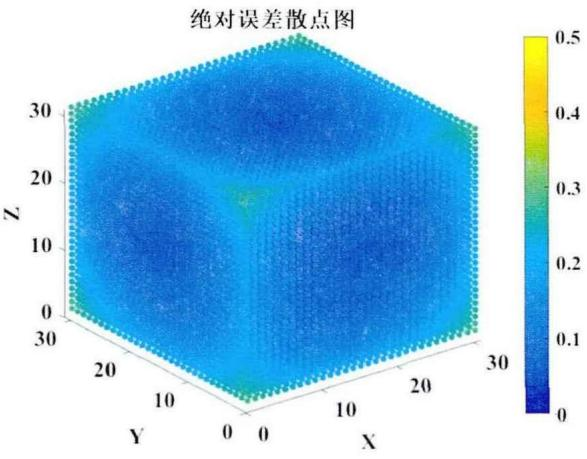\
d) $\sigma=0.08$

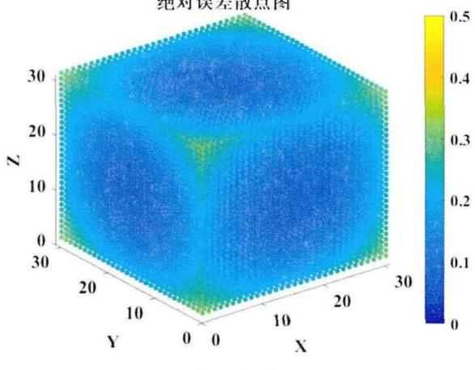\
e) $\sigma = 0.10$

绝对误差散点图\
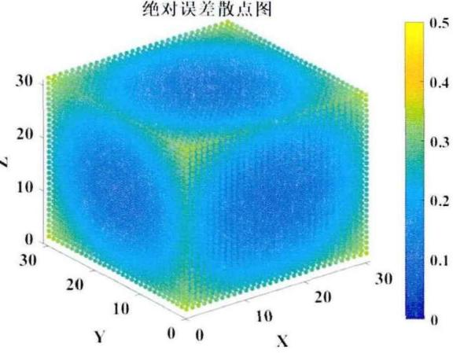\
f) $\sigma = 0.12$

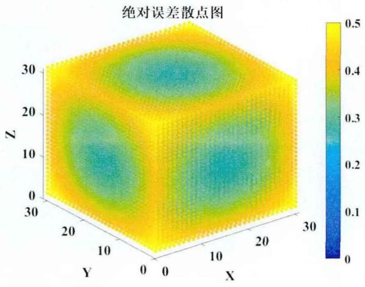\
g) $\sigma = 0.14$\
图 3-8 重建浓度场中的绝对误差随不同高斯白噪声的变化关系

表 3-2 展示了对加性噪声下的重建浓度场质量的评估，定量说明了当标准差在 0.14 时，各个误差的数值迅速增加，模型更加适用于标准差小于 0.14 的浓度测量。

表 3-2 不同标准值下的测量误差(%)

| <!-- --> | <!-- --> | <!-- --> | <!-- --> |
| ---- | ------ | ------ | ----- |
| 标准差  | 最大相对误差 | 平均相对误差 | 均方根误差 |
| 0.02 | 1.77   | 1.70   | 11.07 |
| 0.04 | 1.58   | 2.20   | 11.59 |
| 0.06 | 7.14   | 0.49   | 13.59 |
| 0.08 | 10.83  | 2.20   | 15.89 |
| 0.10 | 15.14  | 4.12   | 19.14 |
| 0.12 | 16.05  | 4.52   | 19.88 |
| 0.14 | 48.43  | 16.80  | 50.06 |

## 3.3 本章小结

本章主要针对多元混合气体介质中的声传播特性进行研究，研究内容分为多元混合气体中声学特征参数的模型建立和浓度场的重建，从计算角度证明了检测方法在多元混合气体中的可行性，并且根据重建结果检验了模型的准确性。

（1）建立多元混合气体中的声速模型和声衰减模型，按照混合气体中各组分气体的占比，确认混合气体中的各个物性参数，并结合实际情况进行参数的修正，从而得到总的声速和声衰减系数，根据计算结果发现，声速和声衰减系数在不同成分的混合气体中随着气体浓度的变化表现出不同的变化规律，之后提出多元混合气体的声速和声衰减结合检测的方法，通过确定的声速值和声衰减系数值在三维空间图中做切面并在水平面上进行投影，从而同时确定混合

气体中的两种气体组分浓度。

（2）本章进行了多元混合气体浓度场的重建，提出局部热平衡假设来实现待测空间中浓度场的局部均匀性，为浓度场的声学重建提供了理论条件，介绍了重建原理和常见的评估气体浓度场的重建质量的评价指标，采用最小二乘法进行求解，提出基于声速的浓度场重建方法，并利用该方法对二氧化碳-氮气浓度场进行重建，对比了不同的数学模型，分析了未加噪声和加性噪声下气体的浓度分布，单峰对称模型中重建浓度分布最小的平均相对误差为 $0.21\%$ 判断，重建浓度场的抗噪性能在标准差小于0.14时表现良好。

## 第 4 章 多元混合气体中声学特性参数测量实验研究

基于第三章中对超声波在多元混合气体中声传播特性的研究以及对测量区域浓度场重建的研究，得到浓度场中的气体分布状态，本章探究的是通过搭建实验平台，在建立稳定的多元混合气体环境的基础上，实现单路径对声速和声衰减系数的测量，与第三章中相关模型的计算值进行对比，通过实验验证声学气体检测方法的有效性和准确性，另外，为进一步确定测量方法在实际工作环境中的应用效果，在实验室条件下模拟锅炉尾部烟道环境，进行二氧化碳浓度的测量实验。

## 4.1 气体声学实验装置

## 4.1.1 气体声学气体腔腔体设计

气体声学实验装置设计较为复杂，主要面临的问题是装置需要在保证气密性良好、承担一定压力的同时进行声学特性参数的测量，这对装置本身的材料和形状，测量方法的选择、实验方法的设计都有较高的要求。

在实验装置气体腔腔体的选择上，选择了方形腔体，可以更好地布置实验相关的测量仪器。另外由于在实验开始之前，需将腔体内原有的残余气体尽量排空，排气和充气的次数和时间越多，腔体内的气体环境就更加纯净，这就需要腔体要承受一定的高于环境大气压的压力，保证外界环境气体不会扩散进入腔体中，但高耐压的腔体制作成本较高。因此为保证腔体内环境的稳定性和纯净度，降低实验的成本，实验采用具有一定耐压性能的腔体材料，通过设计合理的实验方案弥补腔体设计的局限性，提高实验结果的可信度。

在确定腔体设计方案后，要确定超声波换能器的选择。在综合多个研究小组采用的测量方案之后，确定采用固定频率的超声波传感器，固定传感器的位置，通过调节超声波传感器之间的距离进行测量，保证测量更加精准。

综合各种因素的考量，设计了适用于本实验的气体声学实验装置，实验台的整体结构如图4-1所示。腔体尺寸为 $0.3m\times0.3m\times0.6m$ ，从图中可以看出，腔体用一面有机玻璃进行封盖，便于观察腔体内的情况。在腔体的底部中心轴线上，左右两侧布置了两根带有刻度的光滑轴导轨，两导轨前端分别布置了固定发射和接收的超声传感器的平台，可以准确改变传感器之间的距离，腔体前侧设计了三个进气口，用于不同种类气体的通入，后侧有一个排气口。腔体的所有连接处，均采用密封胶条或密封胶处理，保证腔体的气密性。另外，在腔体内部设置了一个风扇，保证多种气体混合的均匀性，布置了电加热棒和温湿度计，控制腔体内的温度变化并进行实时监测，在腔体的左侧安装了压力计观察腔体内部的压力变化，保证实验条件的一致性。

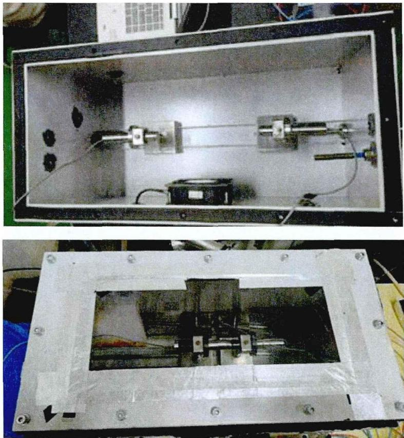\
图 4-1 气体声学实验装置气体腔

## 4.1.2 实验系统设计

基于超声波测量多元混合气体的组分和浓度实验系统，主要包括采集系统，测量系统和配气系统，其中，测量系统主要为气体腔的腔体，具体的实验系统图如 4-2 所示。

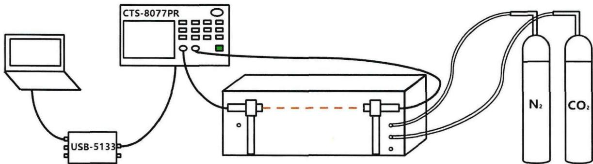\
图 4-2 超声波测量多元混合气体组分和浓度的实验系统

采集系统主要包括 CTS-8077PR 型脉冲发生接收仪，可对发射的超声波特性，脉冲宽度、脉冲电压、脉冲重复频率进行调节；USB-5133 数据采集卡，采样速率达到 100MS/s，提供了灵活的耦合、阻抗、电压范围和滤波设置；如图 4-3 所示。超声波换能器选择气体流量计专业换能器，声波频率为 135KHz，测量量程在 0.1\~1.5m。

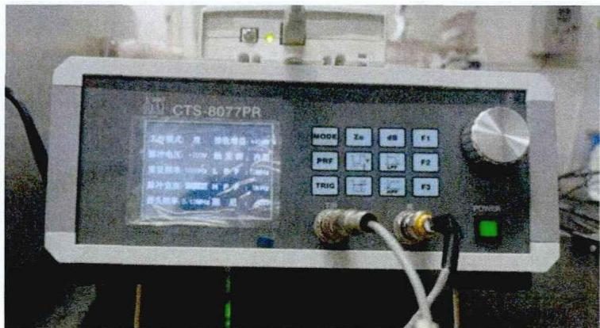\
图 4-3 脉冲发生接收仪和采集卡

配气系统主要是通过可控流量的流量计控制不同气体的流量确定各个气体的比例，再同时通入到腔体中营造测量所需的气体环境。实验选择的流量计为七星D07-9质量流量控制器（测量准确度为 $\pm 2\%$ ）和D08-LF型流量显示仪，可直接对从气瓶中流出的气体进行调节；实验中选择的气体为氮气、氩气和二氧化碳在不同环境背景下的混合气体，气瓶、流量计和腔体的气体入口之间用不同尺寸的四氟管连接。实验装置如图4-4所示。

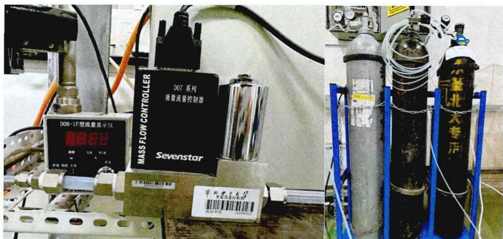\
图 4-4 质量控制流量计和气瓶

## 4.1.3 实验方法与测量步骤

首先要根据实验所需混合气体的比例计算各个气体的流量，从而确定流量计的示数。在实验进行前，需要对气体腔充气。将整个实验系统接通后，保持排气口的通畅。打开气瓶上的减压阀开关，气体进入整个系统后，同时调整流量计的示数，确保进入腔体的气体比例，每次进行充气时，充气量要大于腔体的体积才可以将腔体内的原有气体排光，根据总的气体流量和腔体的体积确定每次充气的时间，在实验过程中每次充气的时间在 20 分钟左右，基本可以保证腔体中充满了待测气体。为了保证实验环境的均匀性和稳定性，在充气的过程中将风扇打开，将不同种类的气体充分混合，另外，在实验过程中，将排气口微微打开的同时确保腔体内的气体压强始终保持略高于外界大气压强，避免外界气体进入，实验中时腔体内的压强一直稳定在 2.5-3KPa 左右，腔体内可以视作一个相对密闭的空间，气体处于扩散状态。

在进行声学特征参数测量时，固定声发射的超声波换能器，在导轨不同距离上接收信号的超声波换能器可以得到多个声波幅值和声速，通过幅值的变化可以得到声波衰减的规律，在不同位置上声速的测量反映了气体状态的变化。实验选用收发一体型的超声波换能器，具有较好的方向性，减少实验误差，提高测量的准确性和可重复性。

实验选用的气体为纯净的氮气、二氧化碳、氩气。研究了三种纯净气体、氮气-二氧化碳、氮气-氩气、氩气-二氧化碳、氮气-二氧化碳-氩气在不同的环境条件和气体占比中的声传播特性，气体的占比从0变化到1，以 $10\%$ 的间隔增加，两个传感器之间的初始距离为 $0.01\mathrm{m}$ ，以 $0.02\mathrm{m}$ 间隔进行声速的测量，以 $0.01\mathrm{m}$ 间隔进行声波幅值的测量，两传感器之间的最远距离为 $0.18\mathrm{m}$ ，由于二氧化碳的衰减较快，进行含有二氧化碳气体的测量时测量距离会缩短。

## 4.2 多元混合气体实验结果分析

## 4.2.1 纯净气体中声速和声衰减特性

实验首先对纯净气体中的声学特征参数进行测量，通过对比不同种类气体、不同温度下的参数变化，来验证测量方法的可行性和准确性。

图 4-5 为三种气体在温度为 $29^{\circ}C$ 时的声速和声波幅值随着两传感器之间距离不断增大的变化规律，从图 4-5 a) 中可以看出声波幅值的初始值在不同种类的气体中基本保持一致，二氧化碳的声波幅值在 0.04m 之前迅速下降，之后下降速度趋于平缓，下降趋势接近对数函数，氮气和氩气的声波幅值分别从 0.08m 和 0.1m 处开始出现明显降低，两者幅值的降低速率都远小于二氧化碳，氩气的幅值降低速率最小，这从它们的声衰减系数也可以明显看出，如表 4-1 所示，二氧化碳的声衰减系数最大，这是由于二氧化碳为多原子分子，相对于氮气双原子分子和氩气单原子分子，除了经典声衰减还有弛豫衰减的作用。从图 4-5 b) 中可以看出随着距离的变化三种气体环境下声速的测量都基本不变，这说明实验营造的气体环境在测量过程中保持稳定和均匀。图中的虚线代表对应气体的声速平均值，声速随着气体摩尔质量的减小不断增大，这与数值计算的规律保持一致，将测量结果于计算结果进行对比，误差保持在 0.03% 左右，测量值是准确有效的。

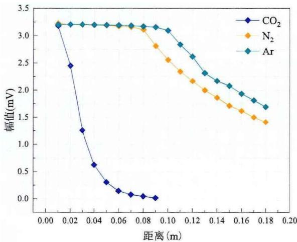\
a)声波幅值

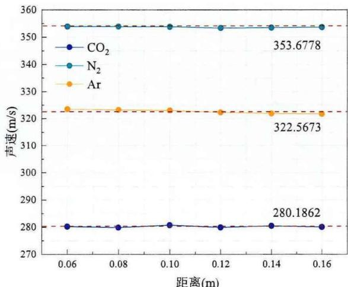\
b)声速\
图 4-5 二氧化碳、氮气和氩气的声波幅值和声速随距离的变化关系

表 4-1 二氧化碳、氮气和氩气的声衰减系数(1/m、29℃)

| <!-- --> | <!-- --> | <!-- --> |
| ------------ | -------------- | -------------- |
| 二氧化碳         | 氮气             | 氩气             |
| 0.068±0.0025 | 0.0079±0.00020 | 0.0075±0.00030 |

为进一步探究环境因素的影响，进行了不同温度下氮气中的声速和声波幅值的测量，它们随着传感器之间距离的变化关系如图4-6所示。从图中可以看出，随着温度的升高，声波幅值降低的速率加快，声衰减系数从原来的0.0086增大到0.0090，对图4-6 b)分析，温度越高，声波的传播速度更快。这是由于温度越高，气体分子的热运动就会更加剧烈，分子之间碰撞的概率增加，声音的振动传播也就更便于传递，声速也就越大，但同时分子的碰撞导致能量更快地从声波中转移出来，从而使声波衰减更快。

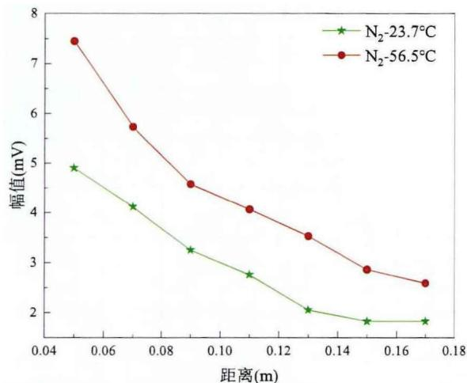\
a)声波幅值

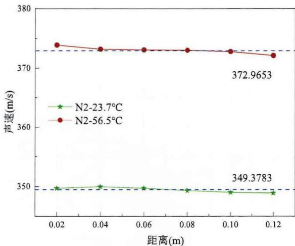\
b)声速\
图 4-6 不同温度下氮气的声波幅值和声速随距离的变化关系

## 4.2.2 二元混合气体中声速和声衰减特性

在对二元混合气体的声学特征参数测量时，进行了氮气-二氧化碳、氮气-氩气、氩气-二氧化碳三组实验，探索二元混合气体中的声传播规律。

图 4-7 为二元混合气体的声波幅值随距离的变化规律以及三组二元混合气体的声衰减系数随气体浓度的变化规律。从图 4-7 a)和图 4-7 b)中可以看出，随着二氧化碳浓度的增加，声波幅值降低的速度不断加快，同时声波幅值在传感器之间距离很小时出现迅速降低，在图 4-7 a)中二氧化碳浓度为 0 时，声波幅值在 0.08m 处才出现明显的降低，当二氧化碳浓度在 100%时，声波幅值在 0.02m 处就已经下降，在整个浓度的变化过程中，氩气-二氧化碳混合气体中声衰减系数从 0.0054 增大到了 0.068，氮气-二氧化碳混合气体中声衰减系数也是从 0.0039 增大到了 0.074，衰减速度增大更多，这是由于氮气作为双原子分子，相对于氩气只有平动自由度，氮气分子中还存在振动和转动自由度，这会导致分子在传递声波能量的过程中吸收更多声波的能量，降低传播效率，进而导致衰减幅度增大。图 4-7 c)为氮气-氩气的声波幅值随氮气浓度的变化规律，图中声波幅值的变化速率基本一致，它们的声衰减系数也集中在 0.0076 左右，但不同气体浓度中声波幅值出现明显下降的位置不同，随着氮气浓度的增加，声波开始出现衰减的位置会更加靠近声发射的一端，因为氮气的摩尔分子质量较高，分子间距较大，更容易吸收和散射声波。综合来看，含有二氧化碳的二元混合气体由于多原子分子具有的声弛豫特征，声衰减现象表现得更加明显和剧烈，实验中对于具有明显衰减特征气体的测量效果和测量规律都会更准确，对于衰减效果相近的混合气体，可以根据声波开始出现明显衰减的位置判断混合气体的成分和浓度。

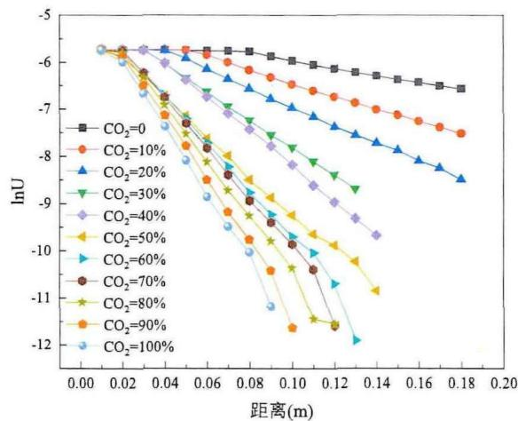\
a) 氮气-二氧化碳声波幅值

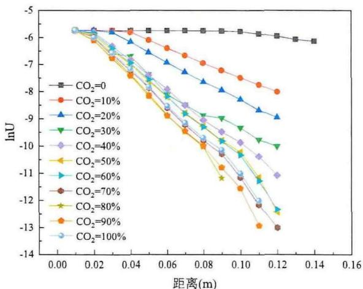\
b)氩气-二氧化碳声波幅值

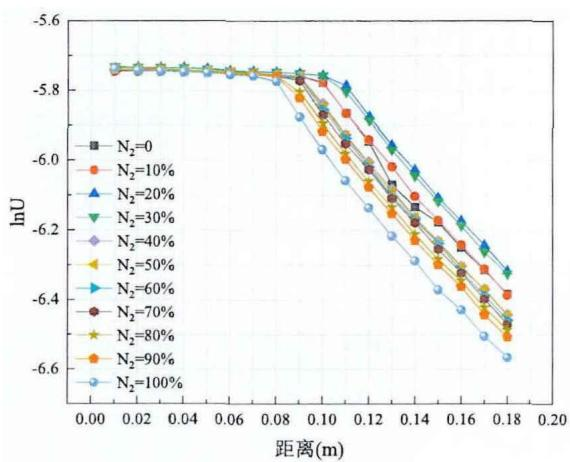\
c) 氮气-氩气声波幅值

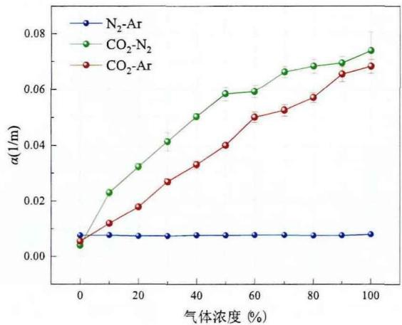\
d)二元混合气体声衰减系数\
图 4-7 二元混合气体声波幅值随距离的变化关系和声衰减系数随浓度的变化关系

图 4-8 展示了这三组混合气体中声速随着气体浓度的变化关系，图中对应颜色的虚线为三组混合气体对应的声速计算值，从图中可以看出在氮气-二氧化碳和氩气-二氧化碳混合气体中声速随着二氧化碳浓度的增大不断减小，其中由于二氧化碳的摩尔分子量与氮气相差更大，所以氮气-二氧化碳的混合气体中声速的变化更加明显；而在氮气-氩气混合气体中，随着氮气浓度的增加，混合气体整体的摩尔分子量减小，声速的变化是呈现明显上升趋势的。通过对比值和计算值的对比，测量的相对误差在 0.1% 以内。

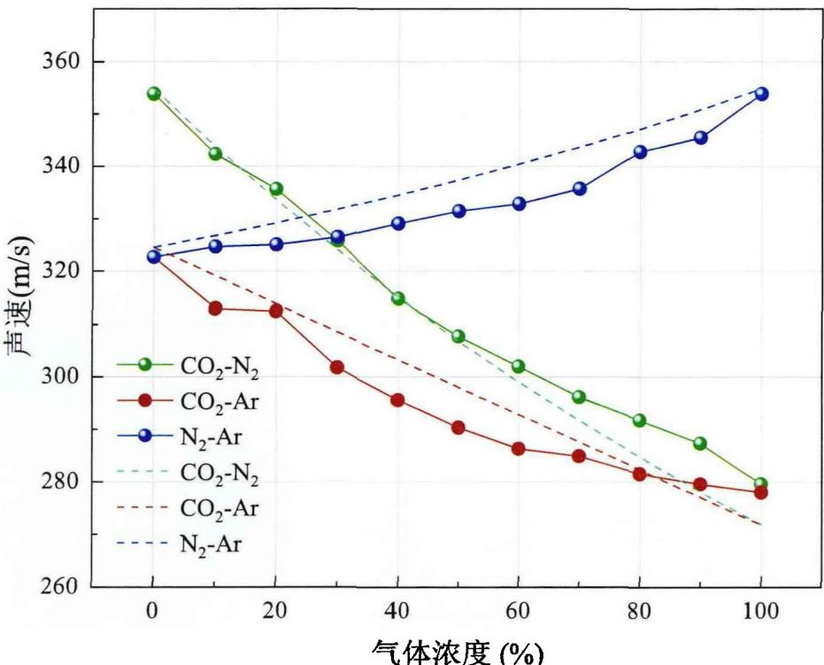\
图 4-8 二元混合气体声速随气体浓度的变化关系

综合整体对二元混合气体的测量结果发现，对于二元混合气体，利用声速或声衰减系数的变化来确定混合气体的组分是可行的，虽然实验测量结果还是存在一定的误差，但从整体的趋势和数值测量是可以进行准确判断的。

## 4.2.3 三元混合气体中声速和声衰减特性

在对单一气体和二元气体进行测量之后，对氮气-二氧化碳-氩气三元混合气体的声学特征参数进行了测量，三种气体的浓度均从0变化到100%，共进行了66组实验，整体的测量温度在18℃左右，根据实验结果，绘制了以氩气为背景气体，二氧化碳和氮气浓度变化时声衰减系数和声速变化的三维曲线图，如图4-9所示。图中的x、y轴分别为二氧化碳和氮气浓度的变化，z轴为分别为声速和声衰减系数值，随着二氧化碳浓度的增加，，声速在276.56m/s\~307.31m/s范围内变化，随着氮气浓度的增加，声速的变化范围为307.31m/s\~343.63m/s，整体声衰减系数的变化范围为0.0025\~0.050。测量结果和规律都与计算一致，说明可以利用测得的实验数据对氮气-二氧化碳-氩气混合气体的不同组分进行判断。

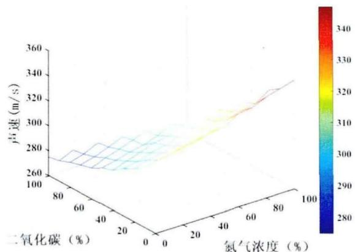\
a)声速变化

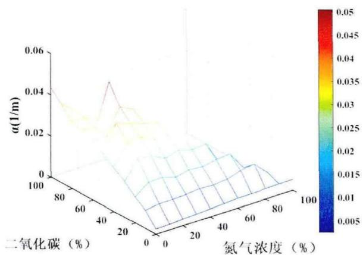\
b)声衰减系数变化\
图 4-9 三元混合气体声速和声衰减系数随气体浓度的变化关系

在声衰减三维图中做声衰减系数为 0.025 的平面并在水平面上投影得到对应曲线，在声速三维图中做声速为 303.26m/s 的平面并在水平面上投影得到对应曲线，两条曲线的交点对应的坐标表示此时混合气体中的二氧化碳浓度为 20%，氮气浓度 30%，进一步得到氩气浓度为 50%，如图 4-10 所示。但由于实验中混合气体的成分控制不够准确以及实验装置本身存在的测量误差，投影曲线不够光滑并且可能会出现多个交点的现象影响判断，需要在之后的研究中进一步改进，提高测量准确性。

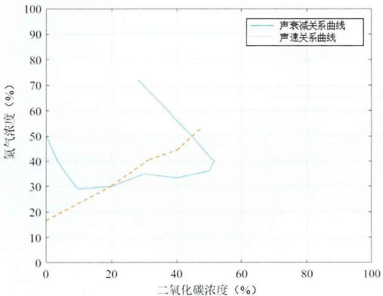\
图 4-10 氮气-二氧化碳-氩气混合气体声速和声衰减在水平面的投影曲线

## 4.3 锅炉尾部烟道中二氧化碳含量的测量

锅炉尾部烟道中二氧化碳含量的监测，是确保锅炉燃烧效率和环保性能的重要方法，它的含量可以反应燃烧过程的充分程度和燃料利用率。尾部烟道中烟气的主要气体成分包括二氧化碳、水蒸气、氮气和微粒物质，烟气在经过脱硫塔后温度在50℃左右，二氧化碳的含量占比在5%\~15%左右。为了使声学气体监测方法更具有实际应用的价值，可以利用它对二氧化碳含量进行实时监测。

## 4.3.1 实验方案设计

实验中利用水浴锅将氮气-二氧化碳混合气体进行加热加湿模拟烟气，具体的实验装置如图 4-11 所示，氮气在水浴锅中加热加湿后进入腔体中，提供模拟烟气中的水分，将二氧化碳流动的管道放置在水浴锅中加热，避免二氧化碳含量的损失，保证气体含量的准确测量。实验中测量的腔体和管道均用泡沫橡胶进行保温，将测量温度保持在 $50^{\circ}$ C，二氧化碳在混合气体中的含量从 5% 以 1% 的间隔变化到 15% 进行测量。

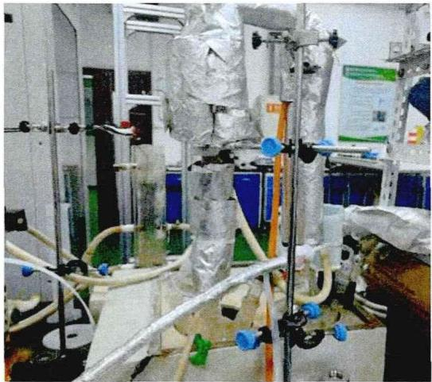\
a) 氮气通道

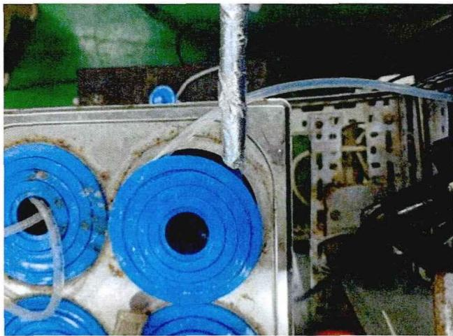\
b)二氧化碳通道\
图 4-11 氮气-二氧化碳混合气体的加热加湿装置

## 4.3.2 测量结果分析

图 4-12 展示了模拟烟气中声衰减系数和声速随着二氧化碳浓度增加的变化关系。从图中可以看出，随着二氧化碳浓度的增加，声衰减系数明显增加，从测量结果中可以判断模拟烟气中的二氧化碳含量变化，声速的整体趋势也是随着摩尔质量的增加不断减小的，但中间气体浓度却无法通过声速的大小进行判断。这说明在复杂的环境中，声衰减系数相对于声速具有更强的抗干扰性和更高的准确性，利用声衰减系数进行实际烟气中的二氧化碳含量是具有很强的可行性的。

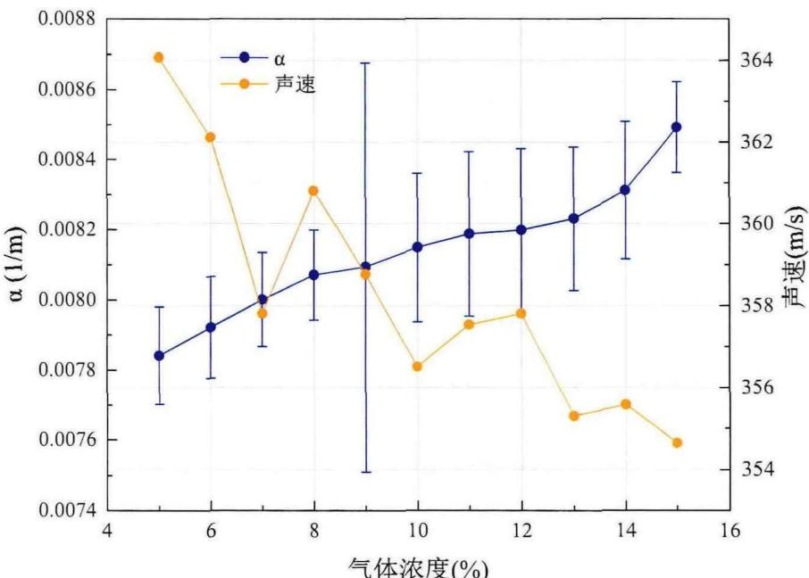\
图 4-12 模拟烟气中的声衰减系数和声速随二氧化碳浓度的变化关系

## 4.4 本章小结

本章基于理论计算的机理设计并搭建了气体声学实验台，构建了多元混合气体的实验环境的同时模拟实际烟气环境，进行声速和声衰减系数的测量。

（1）针对多元混合气体环境的构建和测量方法的特殊性，设计了气体声学实验台中的气体腔腔体，并布置了相关的测量装置，整个实验系统包括采集系统、测量系统和配气系统，采用多次充气并按比例计算流量的方法保证了实验环境的气密性和稳定性。分别进行了纯净气体、二元混合气体、多元混合气体的实验测量。

（2）对实验结果进行分析发现，在纯净气体中将测量结果与计算结果进行对比，测量误差在 0.03% 左右，另外分析了温度对声传播特性的影响，高温条件下声波衰减更快，传播速度也更快。在二元气体中，不同种类的气体分子组合会对声波产生不同的作用效果，利用声波或者声衰减系数单一参数即可判断气体成分，对于衰减特征不明显的气体，可根据声波开始出现衰减的位置来判断。在多元气体中，根据声速和声衰减结合可以准确判断出气体的种类和成分。

（3）为了实现声学测量气体浓度和成分的实际应用，在实验室有限的条件下模拟了温度在 $50^{\circ}\mathrm{C}$ ，二氧化碳浓度在 $5\% \sim 15\%$ 范围的饱和湿烟气，测量了模拟烟气中的声学参数，结果表明声衰减系数在复杂的环境中仍可以判断出气体成分的变化。

## 第 5 章 总结及展望

## 5.1 全文总结

目前，火电厂中锅炉的能耗以及污染物的排放问题仍然影响着锅炉的运行效率，对锅炉中重要气体组分进行实时监测是实现锅炉绿色高效稳定运行的关键。近些年来，各种气体检测方法不断发展的同时仍然存在一定的不足，利用声学特征参数对多元混合气体的成分和浓度进行检测的方法，以其灵活稳定，响应速度快且经济性高的优势，得到了研究人员的广泛关注，用于更加准确的判断气体组分来调整运行工况。

在此基础上，本文基于气体介质中的声速理论和声衰减理论，从多元混合气体的声速和声衰减计算和测量方法进行研究。本文的主要结论如下：

（1）分析了气体介质中的声传播特性，并对气体介质中的声速和声衰减系数进行计算，得到它们与气体种类、环境的物性参数之间的关系。声速的变化受到气体的摩尔分子量、温度的影响较大，在多元混合气体中可以对摩尔分子量相差较大的气体组分可仅用声速判断；摩尔分子量接近的气体的声速相近，但声衰减系数随声波频率的变化规律明显不同，说明利用声衰减系数检测方法可以与声速检测方法形成互补。

（2）提出了一种基于混合气体各组分占比的声速模型和声衰减模型，并将两种模型结合对三元混合气体各组分的浓度进行判断，从理论角度实现了多元混合气体中的声学测量。

（3）对二氧化碳-氮气在待测空间中的浓度场进行重建，得到单峰对称、单峰偏置、双峰偏置这三种模型下的二氧化碳浓度分布，重建浓度分布在单峰对称模型中的平均相对误差为 $0.21\%$ ，另外在一定的标准差范围内，重建温度场表现出了良好的抗噪性。

（4）对于多元混合气体中声学特征参数测量的实验研究，综合气体环境均匀性和密闭性、材料的耐压性、声学测量方法的特殊性等实验要求，设计了气体声学实验系统。

（5）实验选用二氧化碳、氮气、氩气作为研究气体，在纯净气体的测量中，测量误差在 0.03% 左右，在温度较高时，声波衰减的更加剧烈，传播速度更快；对于二元混合气体，声速或声衰减系数均可判断，对于衰减特征不明显的混合气体，也可以通过声波开始衰减的位置进行判断，但测量误差在 0.1% 左右；对三元混合气体的测量结果分析，可以实现对气体成分的反向推导。

（6）在模拟烟气环境中，声学特征参数的测量发现，声衰减系数相对于声速在复杂的环境中，具有更高的稳定性，可以达到二氧化碳浓度在 1% 变化时的测量精度。

## 5.2 展望

未来工作展望：

（1）在对声衰减原理的计算中，并未对弛豫衰减进行深入的研究，而在实际的应用中大多为多原子气体分子，需要进一步建立气体弛豫衰减下的浓度关系模型，确定可用于实际测量的弛豫衰减下的气体浓度测量方法。

（2）本文中设计的气体声学实验装置需要继续研究，目前实验测量时需要依靠测量方法弥补实验装置的不足，但仍然导致了实验误差的产生以及气体的浪费，需要设计一个能够承受足够的压力变化的腔体，提高气体测量环境的精度，选择具有可调频率的超声换能器，布置换能器阵列进行测量，并且可以采用专业的气体成分配比装置得到准确成分的混合气体，提高实验的测量精度，可进一步实现弛豫衰减的测量和机理研究。

（3）针对本文中对锅炉尾部烟道烟气中二氧化碳含量的初步测量，对目前存在的二氧化碳监测方法进行调研，进一步改善二氧化碳测量方法，提高测量的准确性，实现二氧化碳整个浓度场的分析和监测。

## 参考文献

\[1] 史作廷. 努力提升设备装备节能降耗水平 助力企业提质增效高质量发展\[J]. 中国设备工程, 2024, (02): 4-7

\[2] 国家发展改革委等. 《锅炉绿色低碳高质量发展行动方案》 \[R], 2023-11-29

\[3] 朱源, 姜根柱, 王筱蓉, 等. 高温下掺氢燃气层流燃烧速度和稳定性研究 \[J]. 车用发动机, 2023, (06): 26-32

\[4] 彭善碧, 罗雪, 杨林. 掺氢天然气长输管道泄漏扩散规律数值模拟\[J]. 石油与天然气化工, 2023, 52(06): 44-52+59

\[5] 别尔兰·贾纳依汗，王亮, 阮扬帆, 等. 零碳燃料对燃气锅炉燃烧过程调控作用\[J]. 热能动力工程, 2023, 38(11): 123-129+140

\[6] 李敬法, 苏越, 张衡, 等. 掺氢天然气管道输送研究进展\[J]. 天然气工业, 2021, 41(04): 137-152

\[7] 冀丰强, 殷东, 肖寒. 某 600 MW 机组 SCR 装置的流场和浓度场研究 \[J]. 节能, 2023, 42(09): 81-83

\[8] 王书涛, 王昌冰, 潘钊, 等. 光学技术在气体浓度检测中的应用\[J]. 光电工程, 2017, 44(09): 862-871+939

\[9] Comini E. Metal oxides nanowires chemical/gas sensors: recent advances\[J]. Materials Today Advances, 2020, 7: 100099

\[10] 李茹茹, 王凯怡, 密士安, 等. 金属氧化物半导体一维材料 H\_2S 传感器研究进展\[J]. 工程科学学报, 2023, 45(12): 2015-2025

\[11] 郭一明. 金属氧化物-催化燃烧-固体电解质微型混合阵列气体传感器的研发\[D]. 湖北：华中科技大学，2023

\[12] Doubek M, Vacek V, Hallewell G, et al. Speed-of-sound based sensors for environmental monitoring; proceedings of the 2016 IEEE SENSORS, F, 2016 \[C]. IEEE

\[13] Hanspeter W. Fritz Haber: 1868-1934\[J]. Toxicological Sciences, 2000, (1): 1-2

\[14] R G. A New Method of Gas Analysis\[J]. Industrial and engineering chemistry, 1923, 15(12):1277-1278

\[15] Griffiths E. A gas analysis instrument based on sound velocity measurement\[J]. Proceedings of the Physical Society, 1926, 39(1): 300

\[16] Guillon F, Harrison J P, Tyler A. Acoustical time of flight analysis of 3He-4He gas mixtures\[J]. Journal of Physics E Scientific Instruments, 1981, 14(10): 1-1

\[17] Lueptow R M, Phillips S. Acoustic sensor for determining combustion properties of natural gas\[J]. Measurement Science and Technology, 1994, 5(11): 1375

\[18] Terhune J H. Method and apparatus for detecting hydrogen, oxygen and water vapor concentrations in a host gas \[J]. International Journal of Hydrogen Energy, 1986, 4,520,654

\[19] Phillips S, Dain Y, Lueptow R M. Theory for a gas composition sensor based on acoustic properties\[J]. Measurement Science and Technology, 2002, 14(1): 70

\[20] Petculescu A G, Lueptow R M. Synthesizing Primary Molecular Relaxation Processes in Excitable Gases Using a Two-Frequency Reconstructive Algorithm\[J]. Physical Review Letters, 2005, 94(23): p.238301.238301-238301.238304

\[21] Ejakov S G P S, Dain Y, Et Al. Acoustic Attenuation in Gas Mixtures with Nitrogen: Experimental Data and Calculations\[J]. The Journal of the Acoustical Society of America, 2003, 113(4):1871-1879

\[22] Petculescu A, Hall B, Fraenzle R, et al. A prototype acoustic gas sensor based on attenuation\[J]. The Journal of the Acoustical Society of America, 2006, 120(4): 1779-1782

\[23] Petculescu A, Lueptow R M. Quantitative Acoustic Relaxational Spectroscopy for real-time monitoring of natural gas: A perspective on its potential\[J]. Sensors & Actuators B Chemical, 2012, 169(none): 121-127

\[24] Avila D. Design and Verification of a Speed of Sound Sensor for Biogas for Future use in a Fuel Flexible Burner\[M]. University of California, Irvine, 2016

\[25] 丁喜波, 陈晨, 张任, 等. 基于超声波相位差的气体浓度测量方法\[J]. 高技术通讯, 2014, 24(02): 189-192

\[26] 丁欣, 丁喜波, 王丽杰, 等. 基于超声波相位差的氢气检测方法及仪器研制\[J]. 哈尔滨理工大学学报, 2017, 22(05): 81-84

\[27] 刘鸿超. 基于超声波相位差法二氧化碳浓度检测系统的设计\[D]. 黑龙江：哈尔滨理工大学，2023

\[28] Zhang K-S, Ou W, Jiang X, et al. Calculation of vibrational relaxation times in multi-component excitable gases\[J]. Journal of the Korean Physical Society, 2014, 65: 1028-1035

\[29] Zhang K, Ding Y, Zhu M, et al. Calculating vibrational mode contributions to sound absorption in excitable gas mixtures by decomposing multi-relaxation absorption spectroscopy\[J]. Applied Acoustics, 2017, 116: 195-204

\[30] 张克声．基于声传播谱的气体传感技术理论研究\[D]. 湖北：华中科技大学，2015

\[31] 刘岩, 刘石, 雷兢, 等. 基于分子弛豫模型的混合气体多物理场二维重建算法 \[J]. 计算物理, 2014, 31(01): 67-74

\[32] Hu Y, Wang S, Zhu M, et al. Acoustic absorption spectral peak location for gas detection\[J]. Sensors and Actuators B: Chemical, 2014, 203: 1-8

\[33] Yi H, Shu W, Ming Z. A relaxation times coupling method to construct acoustic relaxation calibration for two-frequency measuring gas compositions\[J]. Applied Acoustics, 2016, 113: 102-108

\[34] Zhu M, Liu T, Wang S, et al. Capturing molecular multimode relaxation processes in excitable gases based on decomposition of acoustic relaxation spectra\[J]. Measurement Science & Technology, 2017, 28(8): 085008

\[35] 张向群. 基于声弛豫的掺氢混合气体传感技术研究\[D]. 湖北：华中科技大学, 2022

\[36] Zhao W, Lou W, Xu Y. Concentration measurement of carbon dioxide based on ultrasonic principle\[J]. Measurement: Sensors, 2021, 15: 100040

\[37] 张向群, 王晓静, 刘婷婷, 等. 基于声速频散谱弛豫特征的油中溶解气体检测方法\[J]. 电力系统保护与控制, 2023, 51(03): 173-180

\[38] 周琬婷. 基于声速与声驰豫衰减层析成像的气体温度与组分分布测量\[D]. 北京：华北电力大学，2020

\[39] 张艳婷. 基于声速频散的气体浓度场 CT 成像方法研究\[D]. 湖北：华中科技大学, 2023

\[40] Liu S, Mei J, Zhu M, et al. Identifying gas mixtures based on acoustic relaxation spectroscopy and attention recurrent neural network\[J]. Results in Physics, 2023

\[41] Garrett S. Sonic gas analyzer for hydrogen and methane\[J]. Journal of the Acoustical Society of America, 2008, 123(5): 3372

\[42] Sheen S-H, Chien H-T, Raptis A C. Ultrasonic techniques for detecting helium leaks\[J]. Sensors and Actuators B: Chemical, 2000, 71(3): 197-202

\[43] Cavuoto G, Lago S, Giuliano Albo P A, et al. Speed of sound measurements in liquid methane (CH4) at cryogenic temperatures between (130 and 162) K and at pressures up to 10 MPa\[J]. The Journal of Chemical Thermodynamics, 2020, 142: 106007

\[44] Bahreinimotlagh M, Kawanisi K, Kavousi A, et al. Influence of Suspended Sediment Concentration and Particle Sizes on the Sound Attenuation of the Fluvial Acoustic Tomography Technique\[J]. Journal of Water and Environment Technology, 2020, 18(5): 338–348

\[45] 李晓莹, 张新荣, 任海果. 传感器与测试技术\[M]. 北京: 高等教育出版社,

2004

\[46] 应崇福. 超声学\[M]. 北京: 科学出版社, 2003

\[47] Bass H, Bauer H J, Evans L. Atmospheric absorption of sound: Analytical expressions\[J]. The Journal of the Acoustical Society of America, 1972, 52(3B): 821-825

\[48] 杜功焕, 朱哲明, 龚秀芬. 声学基础\[M]. 南京: 南京大学出版社, 2001

\[49] 鄢舒. 多元混合气体声学特性的数值模拟研究\[D]. 湖北：华中科技大学，2010

\[50] Kinsler L, Frey A, Coppens A, et al. Fundamentals of acoustics, third editionjohn wiley & sons\[J]. Inc New York, 1982

\[51] Dain Y, Lueptow R M. Acoustic attenuation in three-component gas mixtures - Theory\[J]. The Journal of the Acoustical Society of America, 2001, 109(5 Pt 1): 1955-1964

\[52] Knapp C H. The generalized correlation method for estimation of time delay\[J]. IEEE Trans Acoust Speech and Signal Processing, 1976, 24

\[53] 张家容, 赵廷元. 工程常用物质的热物理性质手册\[M]. 新时代出版社, 1987

\[54] 孙慧. 基于声学特性的多组分气体浓度检测机理及方法研究\[D]. 黑龙江：哈尔滨理工大学，2022

\[55] 刘岩. 基于声学法的混合气体温度、浓度和速度分布同时测量方法研究\[D]. 北京：华北电力大学，2016

\[56] Tanczos F I. Calculation of vibrational relaxation times of the chloromethanes\[J]. The Journal of Chemical Physics, 1956, 25(3): 439-447
