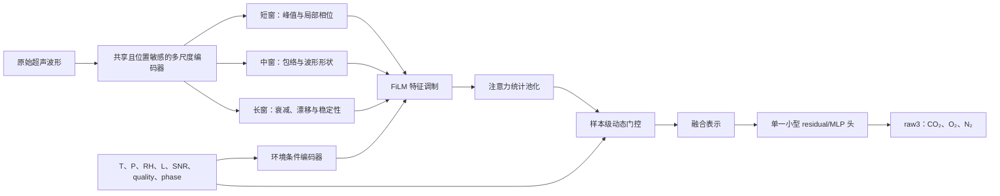

# 端到端波形动态门控组分反演：算法框架、文献证据与 tv3 实施建议

> 文档类型：技术框架与证据评估报告  
> 项目：掘进通风三组分检测（tv3）  
> 检索日期：2026-07-13  
> 检索来源：CrossRef、arXiv（T1），Semantic Scholar（T2）  
> 适用范围：原始超声波形、环境参数、时间窗动态融合与 CO₂/O₂/N₂ 组分回归

## 实施状态（2026-07-14）

- P0 已完成：独立实施计划已冻结 E0–E5、输入形状、可部署输入边界、B1 parity 门和停止条件，未改写 B7、D2b 或 identifiability v1。
- P1/E1 已完成首批代码：新增共享多尺度波形 stem、三种 kernel/dilation 分支、绝对采样坐标一阶统计、固定 `last/mean/max` 聚合和小型 raw3 头。
- E1 不读取 `aux_target_arrays`，没有引入 oracle TOF、真实声速、真实衰减、FiLM、attention 或 MoE。
- 工程验证已通过：E1/E1r 与独立审计共 17 项测试、相关 D2 与波形归一化 58 项回归测试全部通过，共 75 项。
- clean `tv3-formal-6000` 正式 E1 已完成 80 epochs；最佳 epoch 为 72，验证 loss 为 `0.7272`。训练、审计配置、checkpoint、run config 与 B1 reference 的 SHA-256 均与正式 manifest 一致，`checkpoint.pt` 与 `best_checkpoint.pt` 的模型张量完全相同。
- 正式 frame fidelity 未通过：val/test/extrapolation 的 peak MAE 为 `71.19 / 71.87 / 72.33 samples`，P95 为 `154.96 / 154.97 / 154.83 samples`，远高于 `0.15 / 0.25 sample` 预注册门。
- 正式 B1 parity 同样未通过：冻结 sequence embedding 的 O₂ R²为 `-0.0416 / -0.0266 / -0.0895`，相对 B1 分别下降 `0.4697 / 0.5052 / 0.4590`；CO₂通过非劣门，N₂未通过。
- 最终 verdict 为 `frame_fidelity_failed`、`e2_allowed=false`。该结果按停止条件触发了 E1r 前端修复；B7 继续作为默认 RawDSP 头，FiLM、attention 与 MoE 仍停止。
- E1r 前端修复已完成 clean 6000 正式验证：frame fidelity 的 val/test/extrapolation MAE 为 `0.03717 / 0.03746 / 0.03774 sample`，三 split 均通过；但冻结 sequence embedding 的 O₂ R²仅 `0.0162 / 0.0325 / 0.0006`，CO₂和 N₂也未达到 B1 非劣门，最终 verdict=`b1_parity_failed`。
- 当前问题已从“绝对峰位坐标丢失”收敛为“单一峰位坐标加 learned embedding 与固定 `last/mean/max` 聚合不具备 B1 信息充分性”。E1d 正式诊断（`outputs/tv3_ec_msw/e1d_s20260704/`）已完成：正对照通过；TOF-L 校准组 alone 未补回 O₂；在校准栈上加入 SNR 后 compact 集合 `cal_plus_corr_psr_snr` 过门，verdict=`minimal_deployable_set_found`。下一步是可部署 E1d-SB builder；E2 FiLM/attention 仍禁止。

实施细节与当前门禁见 [active/tv3_ec_msw_gatednet_implementation_plan.md](active/tv3_ec_msw_gatednet_implementation_plan.md)。

### 正式 E1 训练与审计结果

训练使用 AdamW、初始学习率 `1e-4`、batch size 16、AMP float16 和 weighted component MSE。验证 loss 在 epoch 24 首次低于 `1.0`，epoch 41 首次低于 `0.8`；ReduceLROnPlateau 在 epoch 58 和 79 将学习率降至 `5e-5` 和 `2.5e-5`。80 epochs 共耗时约 `1.57 h`，最佳 epoch 72 后到训练结束仅退化 `1.51%`，train/val 间隙较小，没有优化崩溃或明显过拟合证据。

以下为 `R² / MAE`，MAE 单位为 vol.%：

| split / 组分 | E1 神经头 | 冻结 embedding Ridge | B1 RawDSP |
| --- | ---: | ---: | ---: |
| val CO₂ | .917 / .324 | .964 / .204 | .988 / .123 |
| val O₂ | -.012 / .804 | -.042 / .816 | .428 / .562 |
| val N₂ | .626 / .857 | .645 / .852 | .878 / .470 |
| test CO₂ | .919 / .313 | .961 / .203 | .991 / .111 |
| test O₂ | -.006 / .811 | -.027 / .815 | .479 / .542 |
| test N₂ | .622 / .898 | .657 / .859 | .890 / .462 |
| extrapolation CO₂ | .929 / .302 | .971 / .181 | .988 / .116 |
| extrapolation O₂ | -.015 / .755 | -.089 / .779 | .369 / .546 |
| extrapolation N₂ | .635 / .828 | .668 / .803 | .876 / .458 |

冻结 Ridge 能改善 CO₂，却不能恢复 O₂，说明失败不只来自神经输出头。B1 仍能从 RawDSP 获得 `0.37–0.48` 的 O₂ R²，因此当前证据指向 learned encoder 丢失了原始波形中已有的峰位 / TOF 信息，而不是训练未收敛。

固定四个 `0.8 vol% O₂` 窗口中，两个边缘窗口的 MAE 约为 `1.16–1.21 vol.%`，两个中间窗口约为 `0.40–0.47 vol.%`；局部斜率范围仅 `-0.168–0.088`，显著偏离理想值 1。低 O₂窗口整体高估、高 O₂窗口整体低估，显示输出向约 19.6% 的全局均值收缩。

失败 E1 在 `stride=2`、`avg_pool factor=4` 后仅保留分支激活的 mean/max/centroid，再用 `last/mean/max` 聚合跨帧信息。E1r 已在下采样前补入可部署位置坐标并通过正式 frame fidelity，但 B1 parity 仍失败，说明坐标准确并不保证 sequence representation 充分。当前下一门是 E1d 冻结表示诊断；不得通过放宽门限或直接进入 E2 绕过验收。

E1r 已将这一不变量落实为“冻结坐标 + learned embedding”：坐标模板沿用 D2b 的 train-only baseline median 产物，不使用 `exact_simulator_debug` 模板；CLI 在训练开始前读取模板、校验 SHA-256，并把模板值与 digest 写入自包含的 `run_config.model_config`。旧 E1 未配置模板时继续走原路径，正式失败 checkpoint 与配置保持可加载。

正式神经头的 `component_metrics` 当前只落盘 MAE、RMSE 与 R²，缺少预注册要求的 bias；该报告完整性缺口不影响本次失败判定，但后续正式运行应补齐。

## 摘要

与“直接分析原始波形，在不同环境参数、组分和时间窗下提取特征，经动态权重中间层融合，再由单一模型输出组分数据”高度相近的方法已经分别出现在原始声学波形、光谱气体反演、条件调制、注意力池化和混合专家等研究中，但尚未形成一个针对超声多组分气体检测的统一标准框架。

本报告建议将这些方法组合为 **环境条件化多尺度波形门控网络**（Environment-Conditioned Multi-Scale Waveform Gated Network，简称 `EC-MSW-GatedNet`）：以位置敏感的多尺度 1D 波形编码器为前端，使用温度、压力、湿度、声程和质量指标生成 FiLM 调制参数；将不同 phase、时间窗和尺度的表示输入注意力统计池化与样本级软门控层；最终由一个小型 raw3 回归头直接输出 `x_CO2`、`x_O2` 和 `x_N2`。

对 tv3 而言，推荐先实施“原始波形学习分支 + 冻结 RawDSP 审计锚点”的混合版本，不直接替换 B7，也不采用模块 C 已失败的早期物理硬分组。该框架可能通过动态选择高质量波形片段和显式环境补偿降低 nuisance，但不能创造单向 TOF 中不存在的独立物理信息，也不能绕过当前可辨识性审计所揭示的秩亏和窄区间误差墙。

## 1. 研究问题与设计边界

### 1.1 目标问题

目标是建立一条可训练、可审计的端到端链路：

1. 直接读取保存的原始超声波形，不使用仿真真值 TOF、真实声速或真实衰减系数作为部署输入；
2. 在短、中、长时间窗以及不同 phase 下提取波形位置、形状、衰减和漂移特征；
3. 使用可部署环境量和质量量对中间特征进行条件调制；
4. 为每个样本动态分配时间窗、尺度或专家权重；
5. 使用一个最终模型直接输出 raw3 组分结果。

### 1.2 必须保留的 tv3 不变量

- 输出严格保持 `raw3`、`out_dim=3`，不使用 N₂ 闭包回填。
- `x_CO2 + x_O2 + x_N2 = 100%` 只作为标签事实与监控指标，不作为输出强制约束。
- gate、FiLM 和回归头只能读取可部署量；真实 TOF、真实声速、真实 alpha 和组分标签不得进入 gate。
- 正式 split 以 mixture、会话或设备为单位；不得按帧随机拆分同一序列。
- 当前 B7 是冻结 RawDSP 默认头。新框架必须先证明 RawDSP parity 和独立增益，不能直接覆盖现有基线。
- 模块 C 已证明“各物理组先独立压缩到低维”的早期硬隔离会显著退化，因此新框架必须使用共享前端后的晚期软融合。

### 1.3 非目标

- 不把模型复杂度增长解释为物理信息增长。
- 不用扩大组分范围后的全局 R²替代固定窄窗口绝对误差。
- 不把仿真 S-Y 或 S-L 结果外推为真实矿井现场能力。
- 不在第一版同时引入自监督、完整 MoE、对抗域适配和新输出契约。

## 2. 推荐总体框架

### 2.1 共享、位置敏感的多尺度波形编码器

前端使用多个 kernel size 或 dilation 的 1D 卷积分支提取不同时间尺度的波形响应。短感受野负责峰顶、局部相位和细小形变；中感受野负责包络、旁瓣和脉冲展宽；长感受野负责跨脉冲衰减、漂移和稳定性。各分支共享底层波形投影或残差骨干，避免把物理组过早隔离。

当前 D2 的重要失败原因之一是过早使用 global average/max pooling，使模型对平移不敏感并丢失 TOF 绝对位置。新前端必须在峰值位置被显式编码前保留采样轴，可使用以下一种或多种机制：

- 绝对采样位置或相位位置编码；
- 保留高分辨率 feature map 的 dilated TCN；
- SincNet 或 LEAF 式可学习滤波前端；
- Res2Net 式层内多尺度表示和跨层特征聚合。

### 2.2 环境条件调制

环境参数不只在最终 MLP 前拼接，而是用于直接改变波形特征通道：

\[
z'_{k}=\gamma_k(e)\odot z_k+\beta_k(e)
\]

其中，`e` 为环境与质量向量，至少包含 `T_C`、`P_MPa`、`H_RH`、`L_m`、phase、SNR、TOF quality 和 accepted ratio。`γ` 与 `β` 由小型条件编码器生成。这一 FiLM 形式允许同一个波形模式在不同温湿度、声程和质量条件下得到不同的解释，而不要求最终回归头隐式学习全部高阶交互。

### 2.3 时间窗 token 与注意力统计池化

每个 phase 或滑动窗产生一个 token：

\[
z_i=\operatorname{Encoder}(waveform_i)
\]

注意力池化根据 token 和质量量计算权重，并同时输出加权均值与加权标准差：

\[
w_i=\operatorname{softmax}(a[z_i,e,q_i]),\qquad
\mu=\sum_i w_i z_i
\]

\[
\sigma=\sqrt{\sum_i w_i(z_i-\mu)^2}
\]

`[μ, σ]` 比单一均值更适合表达跨帧稳定性和异质噪声。时间顺序重要时使用 TCN 或带位置编码的轻量 Transformer；窗数量变化但顺序不重要时，可将 Set Transformer 作为后续对照。

### 2.4 动态权重中间层

第一版建议令“专家”对应感受野或时间机制，而不是对应被硬编码的物理组：

- `E_peak`：峰值、TOF 和局部相位；
- `E_shape`：包络、旁瓣和展宽；
- `E_attenuation`：幅值与衰减；
- `E_drift`：跨帧变化与延迟漂移；
- `E_slow`：慢通道与环境状态。

动态门控为每个样本计算：

\[
z=\sum_k w_k(e,q,z_k)E_k(x)
\]

第一版使用一个共享 softmax gate 和一个 raw3 头，以减少小样本下的路由不稳定。只有在证据显示 CO₂、O₂、N₂ 明显需要不同专家组合时，再将 MMoE 的 component-specific multi-gate 作为独立消融。

### 2.5 最终 raw3 回归头

最终头保持小型、可审计：

- 输入为动态融合表示、必要的慢通道和质量摘要；
- 使用 R5-T 已验证的逐目标标准化训练；
- 直接输出三个独立数值，不回填 N₂；
- 第一阶段可复用 B7 的“冻结 Ridge + OOF residual MLP”思想，使 learned waveform 分支只学习基线未解释的残差；
- train residual 必须来自 OOF 预测，防止泄漏。

## 3. 两种实现版本

### 3.1 混合型端到端版本（推荐先做）

同时保留两条输入分支：

1. learned waveform 分支直接从 raw waveform 学习；
2. 冻结 RawDSP 分支作为位置、质量和声速重建的审计锚点。

晚期 gate 根据环境与质量决定两条分支的相对贡献。该设计能回答“learned waveform 是否提供 RawDSP 之外的稳定增益”，并在 learned branch 失效时保留可追踪的对照证据。

### 3.2 纯端到端版本

在 learned waveform 分支完成 frame fidelity、B1 parity 和独立 OOD 复核后，移除 RawDSP 输入，只保留原始波形、慢通道和可部署元数据。纯端到端版本不是第一阶段入口，因为 tv3 只有约 6000 个 sequence，且历史 D2 已证明未经约束的 raw waveform 网络容易丢失 TOF 坐标或学习仿真细节。

## 4. 直接相关的气体检测证据

### 4.1 多组分波形分解与时序建模

Gong 等将 EMD、CNN 和 LSTM 组合，从重叠的 WMS-2f 信号中同时反演乙炔和氨。实验包含 25 种浓度组合，并使用循环移位与高斯噪声增强；额外条件数据的平均绝对误差分别为 0.092 ppm 和 1.902 ppm。该工作支持“波形分解—局部卷积—时间建模—多组分输出”的总体链路，但其输入是具有组分特异吸收线的光谱信号，不能直接证明超声 O₂/N₂ 也具有同样的信息量。

### 4.2 动态权重气体反演

Hou 等在双组分光致热弹性光谱中组合 SSA、CNN、BiGRU 和 Attention。其注意力根据二次谐波信号特征分配权重，测试集 R²均超过 0.99、平均相对误差低于 1.2%。这是与“不同波形片段经动态权重中间层融合”最接近的直接文献证据。其主要局限同样是光谱选择性显著强于单向声速变化。

### 4.3 双组分 WMS 与数据增强

Zhang 等用 CNN 从 WMS `2f/1f` 信号同时预测 CO₂和 CH₄，并用 GAN 扩充实验光谱信号。该工作证明端到端卷积回归可用于谱线重叠条件下的多输出反演，但 GAN 只能扩充已建模分布，不能替代真实环境与设备 holdout。

### 4.4 超声、热导和环境传感融合

Costa 等将超声、热导、温度、压力和湿度信号融合，使用 185 个不同环境条件下的数据点预测掺氢天然气中的 H₂浓度，报告 R²约 0.98。该工作直接支持“声学主信号 + TCS + 环境补偿 + 回归”的工程方向，也明确承认环境覆盖有限。其任务中 H₂与天然气的物性差异大于 O₂/N₂，结果不能直接迁移为 tv3 的窄区间精度。

### 4.5 超声 O₂与温湿度补偿

Fukuoka 等使用超声飞行时间测量潮湿空气中的 O₂，通过显式温湿度补偿将误差降至约 0.4% 或更低。该研究证明声学 O₂信号并非完全不存在，同时说明温湿度补偿是必要物理环节。这与 tv3 当前“整体粗粒度可辨、窄窗口精细辨识不足”的结论一致。

## 5. 可迁移的通用算法证据

| 模块        | 代表工作                     | 主要贡献                                    | 对 tv3 的意义                 |
| --------- | ------------------------ | --------------------------------------- | ------------------------- |
| 多跨度原始波形   | von Platen et al., 2019  | 多个 CNN 输入分支处理不同时间跨度                     | 对应短、中、长波形窗                |
| 参数化波形前端   | Ravanelli & Bengio, 2018 | SincNet 直接从 raw waveform 学习可解释带通滤波器     | 可减少自由卷积前端的参数量             |
| 全可学习前端    | Zeghidour et al., 2021   | LEAF 联合学习滤波、池化、压缩和归一化                   | 可作为固定 DSP 的后续替代对照         |
| 多尺度残差骨干   | Jung et al., 2022        | RawNet3 使用 Res2Net 与多层特征聚合              | 支持共享前端后的多尺度融合             |
| 环境条件调制    | Perez et al., 2018       | FiLM 根据条件信息做逐通道仿射调制                     | 适合 T/P/RH/L 对波形特征的条件化     |
| 时间窗权重     | Okabe et al., 2018       | Attentive Statistics Pooling 输出加权均值与标准差 | 适合不同质量帧和时间窗的动态聚合          |
| 集合聚合      | Lee et al., 2019         | Set Transformer 建模可变长度集合及元素交互           | 可用于无固定顺序的窗或重复帧集合          |
| 多任务门控     | Ma et al., 2018          | MMoE 为不同任务学习独立 gate                     | 可作为三个组分使用不同专家的后续消融        |
| 变量选择与时间融合 | Lim et al., 2021         | TFT 结合变量选择、门控残差和可解释注意力                  | 提供环境变量选择思路，但完整 TFT 对本项目偏重 |

## 6. 文献目录与证据适用边界

| 类别              | 文献                                                                                                                                                     | 标识                                      | 证据边界                               |
| --------------- | ------------------------------------------------------------------------------------------------------------------------------------------------------ | --------------------------------------- | ---------------------------------- |
| 光声多组分           | Gong et al. (2024), *Empirical Modal Decomposition Combined with Deep Learning for Photoacoustic Spectroscopy Detection of Mixture Gas Concentrations* | DOI: `10.1021/acs.analchem.4c04479`     | 直接支持 EMD-CNN-LSTM 多组分反演；光谱信息强于超声   |
| 动态注意力气体反演       | Hou et al. (2025), *Dual-Component Gas Sensor Based on Light-Induced Thermoelastic Spectroscopy and Deep Learning*                                     | DOI: `10.1021/acs.analchem.4c06588`     | 与动态权重最接近；使用 2f 光谱，不等价于 TOF         |
| 双组分 WMS         | Zhang et al. (2025), *Deep Learning-Enhanced Dual-Component Gas Sensor Based on Wavelength Modulation Spectroscopy*                                    | DOI: `10.1021/acs.analchem.5c03438`     | 支持 CNN 多输出与数据增强；需真实 OOD 复核         |
| WMS 快速反演        | Musiałek & Wojtas (2025), *Calibration-free, machine learning based wavelength modulation spectroscopy sensor for fast gas concentration measurements* | DOI: `10.1016/j.engappai.2025.111026`   | 支持用学习模型替代迭代反演；传感机理不同               |
| 声学与 TCS 融合      | Costa et al. (2024), *In-Situ Concentration Measurement of Blended Hydrogen Gas Using Sensor Fusion Enhanced by Machine Learning Model*                | DOI: `10.1115/IPC2024-120952`           | 直接支持 ultrasonic+TC+环境融合；样本少、H₂信号更强 |
| 超声 O₂补偿         | Fukuoka et al. (2023), *Measurement of oxygen concentration in atmospheric air using ultrasound time of flight with humidity compensation*             | DOI: `10.1063/5.0113877`                | 直接证明温湿度补偿必要；约 0.4% 是特定实验条件结果       |
| 多跨度波形           | von Platen et al. (2019), *Multi-Span Acoustic Modelling Using Raw Waveform Signals*                                                                   | DOI: `10.21437/Interspeech.2019-2454`   | 支持多时间尺度前端；来自语音任务                   |
| SincNet         | Ravanelli & Bengio (2018), *Speaker Recognition from Raw Waveform with SincNet*                                                                        | DOI: `10.1109/SLT.2018.8639585`         | 支持参数化可学习滤波器；频带需按超声重新定义             |
| LEAF            | Zeghidour et al. (2021), *LEAF: A Learnable Frontend for Audio Classification*                                                                         | arXiv: `2101.08596`                     | 支持轻量全可学习前端；需保留 TOF 绝对位置            |
| RawNet3         | Jung et al. (2022), *Pushing the limits of raw waveform speaker recognition*                                                                           | arXiv: `2203.08488`                     | 支持 Res2Net 与多层聚合；数据规模远大于 tv3       |
| FiLM            | Perez et al. (2018), *FiLM: Visual Reasoning with a General Conditioning Layer*                                                                        | DOI: `10.1609/aaai.v32i1.11671`         | 提供通用条件调制算子；需验证环境量是否真实可测            |
| 注意力统计池化         | Okabe et al. (2018), *Attentive Statistics Pooling for Deep Speaker Embedding*                                                                         | DOI: `10.21437/Interspeech.2018-993`    | 支持质量异质帧聚合；需防止 gate 学到 split 偏差     |
| Set Transformer | Lee et al. (2019), *Set Transformer: A Framework for Attention-based Permutation-Invariant Neural Networks*                                            | arXiv: `1810.00825`                     | 适用于集合；若时间顺序关键则不应直接置换不变             |
| MMoE            | Ma et al. (2018), *Modeling Task Relationships in Multi-task Learning with Multi-gate Mixture-of-Experts*                                              | DOI: `10.1145/3219819.3220007`          | 支持按目标动态路由；小样本下有路由塌缩风险              |
| TFT             | Lim et al. (2021), *Temporal Fusion Transformers for interpretable multi-horizon time series forecasting*                                              | DOI: `10.1016/j.ijforecast.2021.03.012` | 变量选择和门控机制可借鉴；完整预测框架非首选             |

## 7. 训练与对比设计

### 7.1 第一阶段损失

第一版只保留已经验证过的主损失结构：逐目标标准化后的 weighted raw3 回归。可写为：

\[
\mathcal{L}_{main}=\sum_{j\in\{CO_2,O_2,N_2\}}\alpha_j
\operatorname{MSE}(\hat y_j^{scaled},y_j^{scaled})
\]

不在首轮同时加入闭包、对抗域适配或复杂专家负载均衡。`sum_abs_error` 继续作为监控指标。

### 7.2 可选的配对表示约束

只有主链路完成 parity 后，才可利用实验设计中的配对样本增加轻量表示约束：

- 同一 mixture、不同环境：补偿后组分表示应保持接近；
- 相同环境、不同 O₂小阶跃：组分表示应保持可分；
- 同一 sequence、不同时间窗：gate 应优先选择质量稳定且对峰值定位有效的窗口。

这类约束用于检验环境补偿是否有效，不得将标签或 oracle 物理量输入 gate。

### 7.3 对比矩阵

| 实验  | 变化                                | 主要问题                  | 进入下一步的门                    |
| --- | --------------------------------- | --------------------- | -------------------------- |
| E0  | 冻结 B1/B7                          | 当前可信基线                | 已完成                        |
| E1  | 多尺度位置敏感 encoder + 固定池化            | raw waveform 是否恢复测量信息 | frame fidelity 与 B1 parity |
| E2  | E1 + 环境 FiLM                      | 条件调制是否降低 T/RH/L 域差    | 固定 holdout 的 P90/MAE 改善    |
| E3  | E2 + attentive statistics pooling | 动态窗权重是否优于固定聚合         | 同步改善 test、S-Y、S-L          |
| E4  | E3 + 晚期软 MoE                      | 不同机制是否需要样本级路由         | 优于等权和单专家，gate 不塌缩          |
| E5  | 混合分支与纯端到端对照                       | RawDSP 审计锚点是否仍必要      | 纯端到端不劣且 provenance 完整      |

## 8. 数据组织与特征比较

### 8.1 三类必要配对

1. **固定 mixture、变化环境**：改变 T、RH、L、SNR 或校准会话，用于衡量 nuisance 对 feature 和 gate 的影响；
2. **固定环境、变化组分**：对 O₂做局部阶跃，同时控制 CO₂和声程，用于衡量局部特征灵敏度；
3. **固定条件、变化时间窗**：比较短、中、长窗以及不同 phase，识别峰值、衰减和漂移信息来自哪里。

### 8.2 需要保存的诊断量

- 每个 window/scale/expert 的 gate 权重；
- gate entropy、最大权重和专家使用率；
- 不同环境组的 embedding 距离；
- 峰值位置、SNR、accepted ratio 与 gate 权重的关系；
- learned waveform 分支对 RawDSP/B1 输出的 residual；
- mixture、device、day、calibration session 和 OOD selector 的分组指标。

## 9. 验收指标与停止条件

### 9.1 必须报告的指标

- 全范围：CO₂/O₂/N₂ 的 MAE、RMSE、R²、bias；
- 窄窗口：每个 `0.8 vol% O₂` 窗口的 MAE、RMSE、P90 和局部斜率；
- OOD：S-Y 与 S-L 分开报告，不合并为统一 OOD；
- 稳定性：多个 training seed、split seed、日期和校准会话；
- gate 健康度：权重分布、专家使用率、质量相关性与塌缩检查；
- raw3：`sum_abs_error` 监控，但不使用闭包回填。

### 9.2 通过门

1. learned waveform 在固定头下先达到 B1 parity；
2. 动态 gate 相对固定平均和等权融合，在 test、S-Y、S-L 上同步改善；
3. 固定窄窗口的 O₂ P90/MAE 改善，而不只是扩大范围后的全局 R²提高；
4. gate 权重主要响应质量、环境和时间窗证据，不使用标签泄漏；
5. 新增模块的改善跨 seed 稳定，且 train-val gap 不明显扩大。

### 9.3 停止条件

- frame fidelity 或 B1 parity 失败：停止组分训练，先修波形前端；
- FiLM 只改善随机 split、不改善环境或会话 holdout：停止环境调制扩展；
- gate 退化为单一专家或与标签分布强相关：判为路由失败；
- 只有全局 R²提高、固定窄窗口 P90不降：判为未改善分辨率；
- 完整动态融合仍不能改善窄窗口：接受信息受限，回到时序、温湿度、声程、flow 或新信息源升级。

## 10. 推荐实施顺序

### P0：冻结独立计划与数据契约

- 新建独立实验计划，不改写现有 B7 和 identifiability v1 产物；
- 明确 raw waveform、slow、quality、phase、window 与 environment token 的形状；
- 固定 mixture/session/device 级 split，禁止 frame 随机拆分；
- 预注册 E0-E5 的门与停止条件。

### P1：位置敏感多尺度前端

- 只实现 shared multi-scale encoder；
- 用 frame fidelity、峰值位置和固定 Ridge/小 MLP 头验证；
- 不加入 FiLM、MoE 或自监督。

### P2：环境 FiLM 与注意力统计池化

- 先加 FiLM，再加 attentive pooling，每次只改变一个因素；
- 使用环境、声程和会话 holdout；
- 保存 gate/attention 诊断。

### P3：晚期软 MoE

- 仅在 E3 已稳定超过固定聚合时启动；
- 专家共享底层编码器；
- 先使用共享 gate，后比较 component-specific multi-gate。

### P4：纯端到端与信息源决策

- learned branch 稳定后再移除 RawDSP 锚点；
- 若窄窗口仍无绝对误差改善，不扩大网络；
- 将结果作为“数据/模型误差”与“物理信息不足”的分流证据。

## 11. 综合判断

该框架在算法上成立，文献也分别支持其关键组成：多跨度原始波形前端、环境条件调制、时间窗注意力、动态专家融合以及多组分气体回归。它最可能带来的收益不是突破物理上限，而是：

- 避免 D2 式过早池化造成的 TOF 位置信息丢失；
- 在不同 T、RH、L、SNR 下动态修正特征解释；
- 降低坏峰、低质量帧和不合适时间窗对结果的影响；
- 将 RawDSP 无法表达的波形形状和跨帧变化作为 residual 学习对象。

对 tv3 的最稳妥策略是从混合版本开始，以 B1/B7 为冻结参照，逐步证明 encoder、FiLM、attention 和 gate 的独立贡献。即使最终模型在全范围取得更高 R²，只要固定窄窗口 P90没有改善，就不能声称精细 O₂检测能力提高。

## 参考文献

1. Gong Z, Fan Y, Guan Y, Wu G-X, Mei L. Empirical Modal Decomposition Combined with Deep Learning for Photoacoustic Spectroscopy Detection of Mixture Gas Concentrations. *Analytical Chemistry*. 2024;96(46):18528-18536. [DOI](https://doi.org/10.1021/acs.analchem.4c04479)
2. Hou J, Liu X, Sun H, et al. Dual-Component Gas Sensor Based on Light-Induced Thermoelastic Spectroscopy and Deep Learning. *Analytical Chemistry*. 2025;97(9):5200-5208. [DOI](https://doi.org/10.1021/acs.analchem.4c06588)
3. Zhang H, Zhang X, Tang J, et al. Deep Learning-Enhanced Dual-Component Gas Sensor Based on Wavelength Modulation Spectroscopy. *Analytical Chemistry*. 2025;97(40):22032-22040. [DOI](https://doi.org/10.1021/acs.analchem.5c03438)
4. Musiałek F, Wojtas J. Calibration-free, machine learning based wavelength modulation spectroscopy sensor for fast gas concentration measurements. *Engineering Applications of Artificial Intelligence*. 2025;155:111026. [DOI](https://doi.org/10.1016/j.engappai.2025.111026)
5. Costa MF, Lee H, Kim S, Hugo R, Park SS. In-Situ Concentration Measurement of Blended Hydrogen Gas Using Sensor Fusion Enhanced by Machine Learning Model. *ASME International Pipeline Conference*. 2024. [DOI](https://doi.org/10.1115/IPC2024-120952)
6. Fukuoka H, Taskin M, Teii K, Kato Y. Measurement of oxygen concentration in atmospheric air using ultrasound time of flight with humidity compensation. *Review of Scientific Instruments*. 2023;94(3). [DOI](https://doi.org/10.1063/5.0113877)
7. von Platen P, Zhang C, Woodland PC. Multi-Span Acoustic Modelling Using Raw Waveform Signals. *Interspeech 2019*:1393-1397. [DOI](https://doi.org/10.21437/Interspeech.2019-2454)
8. Ravanelli M, Bengio Y. Speaker Recognition from Raw Waveform with SincNet. *IEEE SLT 2018*:1021-1028. [DOI](https://doi.org/10.1109/SLT.2018.8639585)
9. Zeghidour N, Teboul O, de Chaumont Quitry F, Tagliasacchi M. LEAF: A Learnable Frontend for Audio Classification. arXiv:2101.08596. [arXiv](https://arxiv.org/abs/2101.08596)
10. Jung J-W, Kim YJ, Heo H-S, et al. Pushing the limits of raw waveform speaker recognition. arXiv:2203.08488. [arXiv](https://arxiv.org/abs/2203.08488)
11. Perez E, Strub F, de Vries H, Dumoulin V, Courville A. FiLM: Visual Reasoning with a General Conditioning Layer. *AAAI*. 2018;32(1). [DOI](https://doi.org/10.1609/aaai.v32i1.11671)
12. Okabe K, Koshinaka T, Shinoda K. Attentive Statistics Pooling for Deep Speaker Embedding. *Interspeech 2018*:2252-2256. [DOI](https://doi.org/10.21437/Interspeech.2018-993)
13. Lee J, Lee Y, Kim J, Kosiorek AR, Choi S, Teh YW. Set Transformer: A Framework for Attention-based Permutation-Invariant Neural Networks. arXiv:1810.00825. [arXiv](https://arxiv.org/abs/1810.00825)
14. Ma J, Zhao Z, Yi X, Chen J, Hong L, Chi EH. Modeling Task Relationships in Multi-task Learning with Multi-gate Mixture-of-Experts. *KDD 2018*:1930-1939. [DOI](https://doi.org/10.1145/3219819.3220007)
15. Lim B, Arık SÖ, Loeff N, Pfister T. Temporal Fusion Transformers for interpretable multi-horizon time series forecasting. *International Journal of Forecasting*. 2021;37(4):1748-1764. [DOI](https://doi.org/10.1016/j.ijforecast.2021.03.012)

## 检索说明

本次检索以 CrossRef 和 arXiv 为 T1 来源，使用 Semantic Scholar 补充摘要与交叉核验。检索词覆盖 raw waveform、multi-scale、dynamic feature fusion、attention pooling、FiLM、mixture of experts、photoacoustic spectroscopy、wavelength modulation spectroscopy、ultrasonic gas composition 和 environmental compensation。结果按 DOI 去重；无 DOI 时按题名和首位作者核对。

本报告不是系统综述，也没有找到与 tv3 完全相同的“单向超声原始波形—环境动态门控—CO₂/O₂/N₂ 三组分回归”公开论文。因此，文献证据支持的是各算法模块的可行性和相邻传感场景的经验，不构成 tv3 窄区间精度已经可达的证明。
